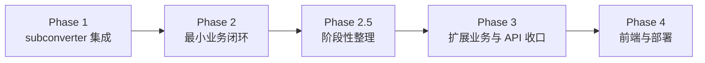

# 推进路线图

本文只记录阶段顺序与后续方向，不维护实时状态。当前状态、缺口与最近验证一律以 [progress/STATUS.md](progress/STATUS.md) 为准。

## Phase 依赖

## 阶段摘要

### Phase 1：subconverter 集成层收口（已完成）

`internal/subconverter/` 已从占位变为可用，`Client`、超时 / 并发控制、错误映射与 golden 测试已落地。

### Phase 2：最小业务闭环（已完成）

已打通「落地 + 中转 → `stage2Init` → `longUrl` → 订阅 YAML`」最小闭环，并固化到 [3pass-ss2022-test-subscription.md](testing/3pass-ss2022-test-subscription.md) 与后端测试。

### Phase 2.5：阶段性整理（已完成）

文档、包边界与下一阶段起点已完成一轮收口；后续仍继续按“单点权威、最小必要”原则裁剪文档。

### Phase 3：扩展业务与 API 收口（已完成）

`stage1/convert`、`generate`、`resolve-url`、`short-links`、订阅读取、失败语义与配置限制已落地；权威契约见 [spec/03-backend-api.md](spec/03-backend-api.md) 与 [spec/04-business-rules.md](spec/04-business-rules.md)。

### Phase 4：前端、部署与发布整理（进行中）

当前重点已收口到默认入口 `/`、`dev / beta / main` 三线发布模型、用户向文档整理、以及以 `Smoke + Comprehensive` fixture 为核心的回归基线。

## 当前方向

1. 继续沿 Beta 线验证默认 `/`、第三方设备部署与发布流程；实时状态见 [progress/STATUS.md](progress/STATUS.md)。
2. 继续补非阻塞的 Playwright 阻断路径与更广 UI 验证，但不把浏览器层扩成高维护矩阵。
3. 持续清理状态类与临时文档，保持 `STATUS` 为唯一活跃状态页。
