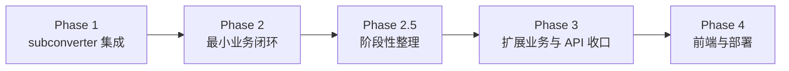

# 推进路线图

## Phase 依赖

## Phase 1：subconverter 集成层收口

**目标**：`internal/subconverter/` 从占位变为可用（已完成）

| 任务 | 说明 |
|------|------|
| 实现 `Client` | 封装 3-pass HTTP 调用，URL 拼接与参数传递 |
| 超时 & 并发控制 | `spec 0.1`：15s 超时、10 并发信号量、达上限立即失败 |
| 错误映射 | 超时/连接失败/非成功 HTTP/不可解析结果 → `SUBCONVERTER_UNAVAILABLE` |
| Golden test | 对接 `testdata/` 已有夹具做 mock 验证 |

## Phase 2：最小业务闭环

**目标**：基于固定测试数据与默认值，打通“落地信息 + 中转信息 -> `stage2Init` -> `longUrl` -> 最终 YAML”的最小业务流程（已完成）

| 任务 | 说明 |
|------|------|
| 固定 `3-pass` happy path | 复用同一条转换管线，校验落地 / 中转 / full-base 三个 pass |
| 默认 `stage2Init` | 对固定测试输入产出默认 `rows`、`availableModes`、`chainTargets[]` |
| 规范 `longUrl` | 基于固定 `stage1Input + stage2Snapshot` 生成确定性长链接 |
| 最终 YAML 渲染 | 通过 `GET /subscription?data=...` 或等价入口回放最终 YAML |
| Golden 验收 | 对齐测试样例中的 request / response / payload / YAML 固定产物 |

明确不纳入本阶段：

- 短链接与 SQLite 存储
- `resolve-url` 恢复判定与 `restoreStatus` 语义
- 完整 `messages[]` / `blockingErrors[]` / HTTP 失败语义收口
- 端口转发完整业务面与更多可选配置组合
- 前端 UI、页面恢复交互与部署编排

## Phase 2.5：阶段性整理

**目标**：在最小业务闭环完成后，先做一次收口整理，再继续扩展其他业务与前端

| 任务 | 说明 |
|------|------|
| 文档收口 | 把阶段目标、验收基线、非目标与后续边界写清楚 |
| 结构整理 | 清理最小闭环阶段产生的临时命名、重复逻辑与职责漂移 |
| 边界确认 | 重新确认服务层、API 层与测试夹具之间的职责边界 |
| 下一阶段盘点 | 为扩展业务、前端与部署准备更稳定的起点 |

待定事项（本阶段仅跟踪，不入 spec 正文）：

- 安全口径归位（含 SSRF 相关历史策略）当前仅在 `ROADMAP/STATUS` 跟踪；进入对应实现阶段后再决定是否并入权威 spec

当前完成状态与阶段性结论统一见 [progress/STATUS.md](progress/STATUS.md)。

## Phase 3：扩展业务与 API 收口

**目标**：在最小闭环稳定后，补齐完整后端业务面与对外契约（未开始）

| 任务 | 说明 |
|------|------|
| `internal/api/` | `stage1/convert`、`generate`、`resolve-url`、`short-links`、`subscription` 端点 |
| 失败语义收口 | `messages[]`、`blockingErrors[]`、HTTP 状态码与字段级错误映射 |
| `resolve-url` | 恢复可重放判定与 `restoreStatus` 冲突语义 |
| `internal/store/` | SQLite 短链接索引（幂等 + LRU 淘汰） |
| `internal/config/` | 应用层限制项：输入大小、URL 数量、长链接长度、短链容量 |

## Phase 4：前端与部署

**目标**：在后端扩展业务稳定后，再推进前端与可运行部署形态（尚未开始）

| 任务 | 说明 |
|------|------|
| 初始化 Vite + React + TS | `web/` 目录 |
| 三阶段 UI | 输入区、配置区、输出区 |
| 对接 API | 消费后端完整对外契约 |
| `cmd/server/` | HTTP 启动、路由注册与运行形态收口 |
| `deploy/` | Docker Compose（app + subconverter） |

> 具体完成状态、已知缺口与阶段性结论统一见 [progress/STATUS.md](progress/STATUS.md)。

## 推荐下一步

按最小增量推进：

1. 完成 `Phase 2.5` 的文档、结构与职责边界收口。
2. 进入 `Phase 3`，补齐恢复、短链、失败语义与完整 API 契约。
3. 最后推进前端与完整部署，形成正式的端到端路径。
