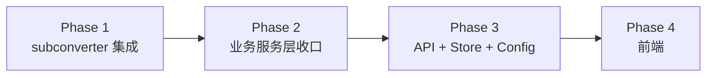

# 推进路线图

## Phase 依赖

## Phase 1：subconverter 集成层收口

**目标**：`internal/subconverter/` 从占位变为可用

| 任务 | 说明 |
|------|------|
| 实现 `Client` | 封装 3-pass HTTP 调用，URL 拼接与参数传递 |
| 超时 & 并发控制 | `spec 0.1`：15s 超时、10 并发信号量、达上限立即失败 |
| 错误映射 | 超时/连接失败/非成功 HTTP → `SUBCONVERTER_UNAVAILABLE` |
| Golden test | 对接 `testdata/` 已有夹具做 mock 验证 |

## Phase 2：业务服务层收口

**目标**：消除 happy-path 原型与 spec 差距

| 任务 | 优先级 |
|------|--------|
| 端口转发 `server:port` 严格校验 (`spec 1.1.2`) | P1 |
| 区域识别改用配置文件正则 (`spec 2.6`) | P1 |
| `vless-reality` 行级限制 (`spec 2.2`) | P1 |
| `restrictedModes` + 错误模型收口 | P2 |
| 输入边界校验（大小、URL 数量） | P2 |

## Phase 3：API + 存储 + 配置

**目标**：真实可运行后端

| 任务 | 说明 |
|------|------|
| `internal/api/` | Gin handlers: 5 个端点 |
| `internal/store/` | SQLite 短链接索引（幂等 + LRU 淘汰） |
| `internal/config/` | 可配置限制项 |
| `cmd/server/` | 依赖装配与启动 |
| `deploy/` | Docker Compose（app + subconverter） |

## Phase 4：前端

**目标**：前端落地

| 任务 | 说明 |
|------|------|
| 初始化 Vite + React + TS | `web/` 目录 |
| 三阶段 UI | 输入区、配置区、输出区 |
| 对接 API | 消费后端 `stage2Init` |

## 推荐下一步

按最小增量推进：

1. 补 `internal/subconverter` 真实 3-pass 集成与错误映射
2. 收口 `internal/service` 的 spec 差距：端口转发校验、区域识别来源、`restrictedModes`
3. 落地 `internal/api`，把 happy-path 原型接成真实 API
