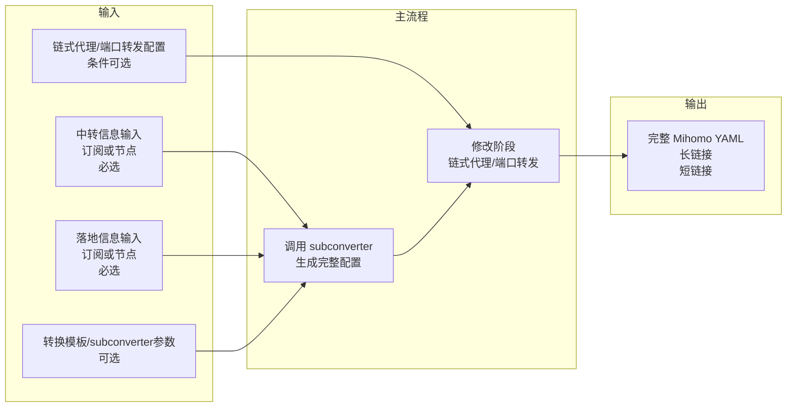

# 01 - 项目概览

## 当前阶段声明：Spec-driven 彻底重构

本项目当前处于 **spec-driven 的彻底重构阶段**：任何既有架构、代码、逻辑、文档与历史决策都可以被质疑；spec 中遇到歧义或隐含假设时，必须提出澄清要求；同时鼓励提出更优实现与最佳实践，并最终以 spec 的结论作为唯一准绳。

## 项目目标与核心价值

帮助用户基于其**已有信息**（订阅、YAML、节点链接、手填节点、中转机 `server:port` 等），通过 **Web 前端**集中完成 **Mihomo** 的**链式代理**和/或**端口转发**配置生成与输出。

当前版本的核心思路是：

- 前端不再围绕“中转输入是否自带通用配置”做分流。
- 前端只负责**引导用户补齐生成完整配置所需的最小输入**：
  - 哪些是中转节点信息
  - 哪些是落地节点信息
  - 落地信息是否已包含在中转输入中
  - 是否有端口转发服务信息
  - 使用默认订阅转换模板（后续可扩展自定义模板）
  - 少量 subconverter 配置项
- 后端统一复用 **subconverter** 逻辑生成**完整配置**，再进入下一阶段的改写。

从产品形态上看，这本质上是一个**面向链式代理/端口转发场景的订阅转换服务**：至少需要形成“中转”和“落地”两类节点信息，然后基于默认模板生成完整 Mihomo 配置。

## 关键术语（概览）

- **转换模板（Template）**：用于让 subconverter 生成可直接作为 Mihomo 基础配置的模板；当前以默认模板为主，后续可扩展用户自定义模板。
- **完整配置（CompleteConfig）**：`通用配置 + 节点集合`，是后续链式代理/端口转发改写的唯一输入基础。
- **角色元信息（Role Metadata）**：除完整配置本体外，还需要额外保留的业务信息，包括哪些节点是中转、哪些节点是落地、落地是否已包含在中转输入中、用户添加的端口转发服务信息等。这些信息将用于下一阶段修改。

## 数据流概览

## 与前置条件的依赖

完整配置的生成规则（统一输入收集、节点角色保留、subconverter 生成）见 [02-generate-complete-config](02-generate-complete-config.md)；修改规则见 [03-modify-config](03-modify-config.md)；接口与输出契约见 [04-output-and-api](04-output-and-api.md)。

