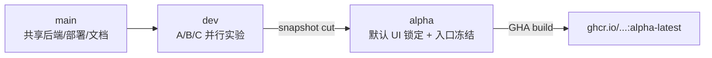
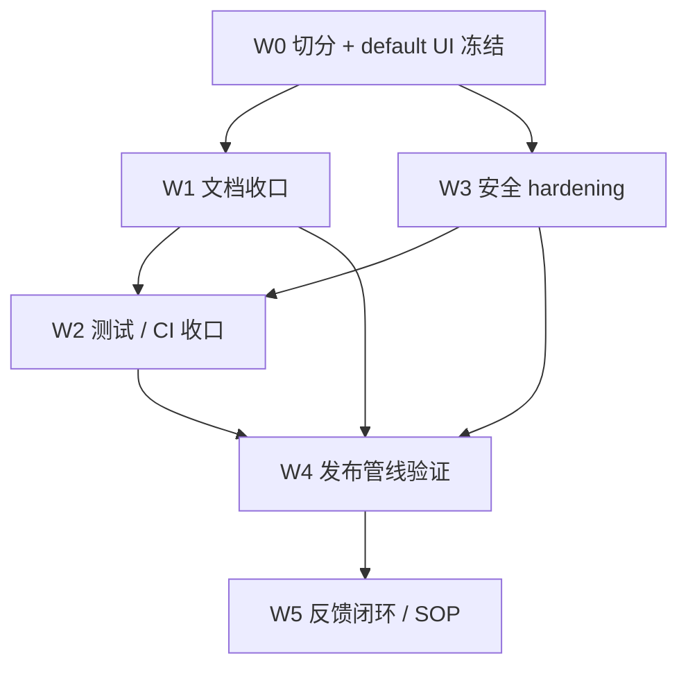

# 3.0 Alpha 收口与发布 Plan

本文是当前阶段执行计划，覆盖切 `alpha` 分支、UI-A 切出默认 UI、文档/测试/安全收口、发布管线验证与反馈闭环 SOP。共 6 个工作流（W0–W5），按依赖顺序推进；W0 含一项需最终确认的实现细节（默认 UI 的目录形态）。

实时进度与已完成项统一维护在 [../progress/STATUS.md](../progress/STATUS.md)。

## 1. 现状与目标差距

- 仓库长期分支口径以 `main` / `dev` / `alpha` 为准；其中 `dev` 是日常集成线（原 `ui-lab`），`alpha` 由 `dev` 在发布节点切出；首次切出会自动触发 [.github/workflows/docker-publish.yml](../../.github/workflows/docker-publish.yml) 的 `build-and-push-alpha-latest` job。
- UI-A 已成熟（[web/src/scheme/a/Page.tsx](../../web/src/scheme/a/Page.tsx) 1642 行 / [index.css](../../web/src/scheme/a/index.css) 1910 行），UI-B/C 仍是探索期；本轮决定"保留 A/B/C 路由入口、从 UI-A 切出独立的默认 UI"，三者后续可独立演化。
- 安全侧 SSRF 完全未防护：[internal/service/managed_conversion_source.go](../../internal/service/managed_conversion_source.go) 的 `&http.Client{Timeout:...}` 直接拉用户提供的 `config` 模板 URL，无 link-local / loopback / RFC1918 / metadata IP 拒绝；旧版 `ALLOW_LOCALHOST_SUBSCRIPTION` 等开关在当前 Go 实现中并未保留（仅 [docs/temp/history/archive/SSRF-Protection-Legacy.md](../temp/history/archive/SSRF-Protection-Legacy.md) 残留描述）。
- 文档：`docs/plan/phase-4-*` 仍是选型期口吻；[../progress/STATUS.md](../progress/STATUS.md) 仍写"A/B/C 评审尚未完成"；`docs/temp/*` 已 gitignore（本地暂存）但目录还在；`_legacy/` 仍在仓库内。
- CI：仅在 push `main` / `alpha` / tag 时构建镜像，`pull_request` 上没有 `go test` / `npm run build` 守门，存在被回归引入未发现的风险。
- 镜像：当前 `alpha-latest` 滚动；本轮**不打不可变 tag**。`subconverter` 镜像浮动 tag `integration-chain-subconverter` 在 SECURITY.md 中需明确权衡。

## 2. 默认 UI 的目录形态（W0 最终决策点）

需在 W0 任一时点最终确认 default UI 的实现形态：

- 选项 α（推荐）：新增 [web/src/scheme/default/](../../web/src/scheme/)，由当前 [web/src/scheme/a](../../web/src/scheme/a) 整目录复制并改 `id`；[web/src/scheme/index.ts](../../web/src/scheme/index.ts) 的 `fallbackUIScheme` 改指 `default`；A/B/C 三个路由入口保留，未指定时回落到 `default`；后续 a/b/c/default 都可独立演化。
- 选项 γ（最轻）：不新建目录；alpha 切出后通过分支纪律保证 a 在 alpha 分支上"冻结"，dev 上 a 继续演化。仓库 diff 极小，但增加分支同步成本。

推荐 α 作为默认实施路径写进 todos；W0 第一步会再次确认。

## 3. 工作流总览

| 工作流 | 关键产出 | 主要文件 |
|---|---|---|
| W0 切分与默认 UI 冻结 | `alpha` 分支 + `web/src/scheme/default/` + 路由 fallback | [web/src/scheme/index.ts](../../web/src/scheme/index.ts), [web/src/scheme/a](../../web/src/scheme/a) |
| W1 文档收口 | README 用户化、删除已完成 plan、STATUS/RELEASES 同步、SECURITY.md | [README.md](../../README.md), [RELEASES.md](../../RELEASES.md), [docs/README.md](../README.md), [docs/progress/STATUS.md](../progress/STATUS.md), [docs/plan/](.), [docs/testing/alpha-release.md](../testing/alpha-release.md), `_legacy/`, `docs/temp/` |
| W2 测试收口 | PR/push CI、test 分层文档 | `.github/workflows/ci.yml`（新增）, [docs/testing/](../testing/) |
| W3 安全 hardening (full) | SSRF 拒绝列表、HTTP body 上限、短链限速、PUBLIC_BASE_URL 强约束、SECURITY.md | [internal/service/managed_conversion_source.go](../../internal/service/managed_conversion_source.go), [internal/api/server.go](../../internal/api/server.go), [cmd/server/main.go](../../cmd/server/main.go), [internal/config/server.go](../../internal/config/server.go), [deploy/docker-compose.yml](../../deploy/docker-compose.yml), [deploy/README.md](../../deploy/README.md) |
| W4 发布管线验证 | alpha-latest 端到端冷启动、Compose smoke 记录 | [deploy/README.md](../../deploy/README.md), [docs/testing/alpha-release.md](../testing/alpha-release.md) |
| W5 反馈闭环与 SOP | issue 模板、回归节奏、Alpha→Beta 退出口径 | `.github/ISSUE_TEMPLATE/`, [docs/testing/alpha-release.md](../testing/alpha-release.md) |

## 4. 工作流细节

### W0 切分与默认 UI 冻结

- W0 第一动作是再确认默认 UI 形态（α / γ），后续 todo 按 α 写，必要时切换到 γ 时只剩"切 alpha 分支 + 跳过 default 目录新增"。
- α 路径下：先在 `dev` 上完成 `web/src/scheme/default/` 复制 + 路由更新 + `npm run build:a/b/c` 与新增 `npm run build:default` 都通过；再以这个 commit 为起点切出 `alpha`：
  - `git switch dev && git checkout -b alpha && git push -u origin alpha`
  - 切出后立即 watch GHA 的 `build-and-push-alpha-latest` job。
- W0 不引入任何业务行为变化；纯目录复制 + 路由 fallback 修改。

### W1 文档收口（用户视角优先）

整理原则：用户视角入口保持 [README.md](../../README.md) → [RELEASES.md](../../RELEASES.md) → [deploy/README.md](../../deploy/README.md) 三跳；开发者入口保持 [AGENTS.md](../../AGENTS.md) → [docs/README.md](../README.md) → spec/。

具体动作：

- 删除 / 归档已完成 plan：[phase-4-breakdown.md](phase-4-breakdown.md)、[phase-4-dev-readiness.md](phase-4-dev-readiness.md) 全文移入 `docs/temp/completed-phases/` 后从主导航移除（与现行 docs/temp 规则一致），主导航 [docs/README.md](../README.md) 同步删条目；ROADMAP 标 Phase 4 已完成。
- 更新 [../progress/STATUS.md](../progress/STATUS.md)：把"A/B/C 方案评审尚未完成"改为"已切出 default UI（基于 UI-A）作为 Alpha 默认入口；A/B/C 入口保留供继续探索"；同步"已稳定范围"与"当前缺口"。
- 重写 [../testing/alpha-release.md](../testing/alpha-release.md)：把"默认 `/ui/a`"改为"默认 `/`（scheme=default）"，保留 `/ui/a|b|c` 作为可选验证入口；冻结项 / 发布前检查 / 反馈记录模板调整。
- [../../README.md](../../README.md) 与 [../../RELEASES.md](../../RELEASES.md) 中的"默认入口 `/ui/a`"统一改为"默认入口 `/`"；强调 A/B/C 仍可访问。
- 删除 [../../_legacy/](../../_legacy/)：迁出仓库（保留单独的 git tag / 离线归档；不进入 alpha 分支镜像层）。当前 [../../Dockerfile](../../Dockerfile) 已只 COPY `cmd` `internal`，`_legacy/` 不会进镜像，但仓库可见性仍可清理。
- 新建 [../../SECURITY.md](../../SECURITY.md)：威胁模型、已知不防护项、报告渠道。具体内容由 W3 完成时确定。

### W2 测试收口

- 在 [../../.github/workflows/](../../.github/workflows/) 新增 `ci.yml`：`pull_request` + `push` 到 `dev|main|alpha` 时触发；matrix 跑：
  - `go test ./...`
  - `cd web && npm ci && npm run build:default && npm run build:a && npm run build:b && npm run build:c`
  - `docker compose -f deploy/docker-compose.yml config`
- 在 [../testing/](../testing/) 新增（或并入 `alpha-release.md`）一份"测试分层"小节：
  - **stable unit**：`go test ./internal/...`
  - **contract**：[internal/api/server_test.go](../../internal/api/server_test.go)、[internal/service/artifacts_integration_test.go](../../internal/service/artifacts_integration_test.go) 与 review fixtures。
  - **smoke**：[../testing/local-dev-smoke.md](../testing/local-dev-smoke.md) 现有手动顺序，对 default UI 跑一次即可。
- [../testing/3pass-ss2022-test-subscription.md](../testing/3pass-ss2022-test-subscription.md) 不动；保留为唯一稳定 fixture。

### W3 部署安全 hardening（full）

按 full_hardening 路线，分三层：

- **代码层（Go）**
  - 在 [../../internal/service/managed_conversion_source.go](../../internal/service/managed_conversion_source.go) 的 `httpClient` 替换为带自定义 `Transport.DialContext` 的 client，DialContext 内 resolve 后拒绝以下 IP 段：`127.0.0.0/8`、`::1/128`、`169.254.0.0/16`、`fe80::/10`、`10.0.0.0/8`、`172.16.0.0/12`、`192.168.0.0/16`、`fc00::/7`、`0.0.0.0/8`、`224.0.0.0/4`；并强制 scheme=http(s)（已有）+ 端口在常规集（80/443/8080/8443/可选自定义）。提供 env 开关 `CHAIN_SUBCONVERTER_TEMPLATE_ALLOW_PRIVATE_NETWORKS=true` 给本地开发用。
  - 在 [../../internal/api/server.go](../../internal/api/server.go) 的 `decodeJSONBody` 前加 `http.MaxBytesReader`，全局 body 上限默认 256 KiB；`MaxLongURLLength` / `MaxInputSize` 保持现有应用层语义。
  - 在 [../../cmd/server/main.go](../../cmd/server/main.go) 的 `http.Server` 上加 `ReadTimeout` / `WriteTimeout` / `IdleTimeout`（仅 `ReadHeaderTimeout` 当前 5s）。
  - 短链 / 转换接口加最简 IP 限速（基于 `net/http` 内嵌 token bucket 或 `golang.org/x/time/rate`）：默认每 IP 60 req/min，可关闭。
  - [../../internal/config/server.go](../../internal/config/server.go) 中加一个 `RequirePublicBaseURL` 选项；启用时若 `PUBLIC_BASE_URL` 为空则启动失败，避免反代场景下 Host 头欺骗导致短链/订阅链接被替换。
- **部署层（Compose）**
  - [../../deploy/docker-compose.yml](../../deploy/docker-compose.yml)：给 `subconverter` 服务加 `networks: [internal-only]`（无 outbound）/或在 README 写"如必须出站，建议加 egress firewall 规则"。
  - 给 `app` 与 `subconverter` 加 `deploy.resources.limits` 建议（不强制）。
  - [../../deploy/README.md](../../deploy/README.md) 新增"安全建议"小节：HTTPS 反代终止时必须显式设置 `PUBLIC_BASE_URL`；公网部署建议开启 `RequirePublicBaseURL`；说明 SSRF 防护边界与 `_ALLOW_PRIVATE_NETWORKS` 开关含义。
- **SECURITY.md**
  - 列出威胁模型：SSRF（已有最小防护 + 部署侧建议）、短链滥用（容量上限 + 限速）、Host 头欺骗（PUBLIC_BASE_URL 强约束）、`/internal/templates/<id>.ini` 公开（按非长期凭证、TTL 后清理处理）、subconverter 出站（建议 egress 控制）、SQLite 卷写入（默认命名卷持久化、单实例假设）。
  - 不防护项：DDoS、恶意订阅源被订阅器消费导致用户客户端风险、跨用户隔离（Alpha 只面向局域网/自部署）。

### W4 发布管线验证

- 切 alpha 分支 → 等 GHA 完成 `alpha-latest` 推送 → 在干净测试设备执行 [../../deploy/README.md](../../deploy/README.md) 第三方设备单段命令 → 跑 [../testing/alpha-release.md](../testing/alpha-release.md) 的"发布后最小回归"。
- 验证：`docker compose ps` 双健康、`/healthz`、`/ui/`（→default）、`POST /api/stage1/convert`、生成 longUrl、`GET /sub?...`、短链创建 + 容器重启后保留。
- 在 [../progress/STATUS.md](../progress/STATUS.md) 的"最近验证"段加一行 alpha 切分日期。

### W5 反馈闭环与 SOP

- 新增 `.github/ISSUE_TEMPLATE/alpha-feedback.md`（按 [../testing/alpha-release.md](../testing/alpha-release.md) 已有反馈记录模板字段定义）。
- 在 [../testing/alpha-release.md](../testing/alpha-release.md) 末尾补一节 "Alpha → Beta 退出口径"：连续 N 周回归无 P0、SSRF 防护与 PUBLIC_BASE_URL 强约束在生产配置稳定、UI-A 不再依赖未确认的 default 目录变更，则启动 Beta 候选冻结。

## 5. 推进顺序与依赖

- W0 先做，是后续所有工作的基线（分支 + 默认 UI）。
- W1 与 W3 可并行；W3 涉及代码改动需要 W2 的 CI 兜底，所以 W3 完成后再合并 W2。
- 进入 W4 前必须 W1（文档与发布说明）+ W3（安全代码）+ W2（CI 守门）三条都收口，避免在测试设备上跑到旧文档/旧镜像。
- W5 最后做，且大部分是文档动作。

## 6. Todo 列表

按依赖顺序执行；推进进度由 Cursor plan 文件 `.cursor/plans/alpha-cutover-and-hardening_*.plan.md` 实时维护。

### W0 切分与默认 UI 冻结

- W0.1 再确认默认 UI 的目录形态：α（推荐，新增 `web/src/scheme/default/` 复制 a 内容）或 γ（仅靠分支纪律冻结 a）。
- W0.2 α 路径下：复制 [../../web/src/scheme/a/](../../web/src/scheme/a/) 为 [../../web/src/scheme/default/](../../web/src/scheme/)；改 id 与 import；更新 [../../web/src/scheme/index.ts](../../web/src/scheme/index.ts) 的 `fallbackUIScheme` 与 `orderedSchemes`；[../../web/package.json](../../web/package.json) 加 `build:default`。
- W0.3 在 `dev` 上完成 default scheme 复制并所有 build 绿后，`git switch dev && git checkout -b alpha && git push -u origin alpha`；watch GHA `build-and-push-alpha-latest`。

### W1 文档收口

- W1.1 把 [phase-4-breakdown.md](phase-4-breakdown.md) 与 [phase-4-dev-readiness.md](phase-4-dev-readiness.md) 移入 `docs/temp/completed-phases/`；从 [../README.md](../README.md) 主导航移除引用；[../ROADMAP.md](../ROADMAP.md) 标 Phase 4 已完成。
- W1.2 重写 [../progress/STATUS.md](../progress/STATUS.md)（A/B/C 评审段落 + 已稳定范围 + 当前缺口）、[../../RELEASES.md](../../RELEASES.md)（默认入口 `/ui/`）、[../../README.md](../../README.md)（默认入口 `/ui/`、保留 A/B/C）、[../testing/alpha-release.md](../testing/alpha-release.md)（默认 UI 与回归入口）。
- W1.3 把 [../../_legacy/](../../_legacy/) 移出仓库（建议打 `git tag legacy-snapshot` 后删目录），确认 [../../Dockerfile](../../Dockerfile) 不会复制；本地 `docs/temp/` 已 gitignore，仅整理本地暂存。

### W3 安全 hardening

- W3.1 在 [../../internal/service/managed_conversion_source.go](../../internal/service/managed_conversion_source.go) 替换 `httpClient` 的 `Transport.DialContext`，resolve IP 后拒绝 loopback / link-local / RFC1918 / metadata / multicast 段；强制 scheme=http(s) 与端口集；加 env 开关 `CHAIN_SUBCONVERTER_TEMPLATE_ALLOW_PRIVATE_NETWORKS`。
- W3.2 在 [../../internal/api/server.go](../../internal/api/server.go) 的 `decodeJSONBody` 前加 `http.MaxBytesReader`（默认 256 KiB），[../../cmd/server/main.go](../../cmd/server/main.go) 的 `http.Server` 加 `ReadTimeout` / `WriteTimeout` / `IdleTimeout`。
- W3.3 给 `/api/stage1/convert`、`/api/generate`、`/api/short-links`、`/api/resolve-url` 加最简 per-IP 限速（默认 60/min，可由 env 关闭）。
- W3.4 [../../internal/config/server.go](../../internal/config/server.go) 加 `RequirePublicBaseURL` 选项；启用且 `PUBLIC_BASE_URL` 为空时启动失败；[../../deploy/README.md](../../deploy/README.md) 描述何时应启用（HTTPS 反代 / 公网部署）。
- W3.5 [../../deploy/docker-compose.yml](../../deploy/docker-compose.yml) 加 `subconverter` 内部独立网络与 README 注释；[../../deploy/README.md](../../deploy/README.md) 安全建议小节（egress 控制、`PUBLIC_BASE_URL` 强约束、`_ALLOW_PRIVATE_NETWORKS` 开关）。
- W3.6 新建 [../../SECURITY.md](../../SECURITY.md)：威胁模型、已落地防护、不防护项、报告渠道；与 [../../deploy/README.md](../../deploy/README.md) 安全建议互链。

### W2 测试收口

- W2.1 [../../.github/workflows/ci.yml](../../.github/workflows/) `pull_request` + push 到 `dev|main|alpha` 时跑 `go test ./...` + `npm run build:default/a/b/c` + `docker compose -f deploy/docker-compose.yml config`。
- W2.2 在 [../testing/alpha-release.md](../testing/alpha-release.md) 或新增小节里补充 stable unit / contract / smoke 三层测试边界；重申唯一 fixture 是 [../../internal/review/testdata/3pass-ss2022-test-subscription/](../../internal/review/testdata/3pass-ss2022-test-subscription/)。

### W4 发布管线验证

- W4.1 在干净测试设备执行 [../../deploy/README.md](../../deploy/README.md) 单段命令；跑 [../testing/alpha-release.md](../testing/alpha-release.md) 发布后最小回归（含 default、a、b、c 四个入口至少一次连通验证）；记录到 [../progress/STATUS.md](../progress/STATUS.md) 最近验证段。

### W5 反馈闭环

- W5.1 [../../.github/ISSUE_TEMPLATE/alpha-feedback.md](../../.github/ISSUE_TEMPLATE/) 按 [../testing/alpha-release.md](../testing/alpha-release.md) 反馈字段生成模板。
- W5.2 [../testing/alpha-release.md](../testing/alpha-release.md) 末尾补 Alpha → Beta 退出口径（连续无 P0、安全配置稳定、default UI 已不再依赖临时变更）。

## 7. 不在本轮范围

- 不打不可变版本 tag（仅 `alpha-latest` 滚动）。
- 不做 Beta 候选冻结。
- 不做 i18n、不做移动端适配、不引入鉴权（与 [../../RELEASES.md](../../RELEASES.md) 已知限制一致）。
- 不重写 spec 02–04 业务规则；W1 仅同步引用与状态字段。
- 不替换 `subconverter` 浮动 tag 为 sha256 digest（仅在 SECURITY.md 中给建议）。
