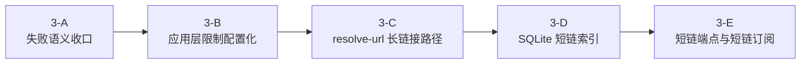

# Phase 3 细化计划

本文细化 [ROADMAP](../ROADMAP.md) 中 `Phase 3` 的子阶段、依赖关系与建议推进顺序；接口与业务约束仍分别以 [spec/03-backend-api](../spec/03-backend-api.md) 与 [spec/04-business-rules](../spec/04-business-rules.md) 为准。

## 当前基线

- `internal/subconverter` 已完成 3-pass HTTP 管线、超时与并发控制、错误归类。
- `internal/service` 已完成 `stage2Init`、长链接编码解码、快照校验与最终 YAML 渲染所需基础能力。
- `internal/api` 已提供 `POST /api/stage1/convert`、`POST /api/generate`、`GET /subscription?data=...` 与 `GET /healthz`。
- `internal/store` 当前仍是包级占位，短链存储尚未开始。
- `deploy/docker-compose.yml` 当前仍是 API-only 本地验证形态。

## 子阶段划分

## 3-A：失败语义收口

目标：

- 把现有 `stage1/convert`、`generate` 与订阅渲染路径的失败响应统一收口到 spec 已定义的 `messages[]`、`blockingErrors[]`、HTTP 状态码与 `scope/context` 语义。
- 补齐当前最小闭环之外仍缺失的 `422`、`503` 与 `500` 错误码映射。
- 让后续 `resolve-url`、`short-links` 与短链订阅可以直接复用同一套错误基础设施。

验收：

- API 与服务层测试覆盖主要失败路径。
- `go test ./internal/...` 通过。

## 3-B：应用层限制配置化

目标：

- 在现有配置基础上，补齐阶段 1 输入总大小上限、每字段 URL 数量上限与短链索引容量上限。
- 复用现有长链接长度限制配置口径，不重复引入第二套 `longUrl` 长度配置。
- 让服务层与 API 层统一消费这些限制项，避免在业务逻辑中散落硬编码阈值。

说明：

- 本子阶段不预先锁定具体配置文件拆分；实现时只要求配置边界清晰、命名与职责一致。

验收：

- 配置加载、默认值与边界校验有单元测试覆盖。
- `go test ./internal/...` 通过。

## 3-C：`POST /api/resolve-url` 长链接路径

目标：

- 先实现长链接解析与恢复判定路径：输入规范长链接，返回 `longUrl`、`restoreStatus`、`stage1Input` 与 `stage2Snapshot`。
- `restoreStatus` 判定复用生成前校验与 3-pass 管线，不单独发明第二套恢复逻辑。
- 在短链能力尚未完成前，先把长链接恢复路径独立落地，供前端 Phase 4 使用。

说明：

- 本子阶段只覆盖长链接输入；短链接解析与相应存储错误语义在 3-D/3-E 接入。

验收：

- `replayable` 与 `conflicted` 判定路径有测试覆盖。
- API 集成测试覆盖长链接恢复路径。

## 3-D：SQLite 短链索引

目标：

- 在 `internal/store` 落地 SQLite 短链索引，实现 `shortId -> longUrl` 反查与 `longUrl -> shortId` 幂等映射。
- 记录至少包含 `shortId`、`longUrl` 与 `lastAccessedAt`，并按 spec 落实容量上限与 LRU 淘汰。
- 将数据库文件纳入持久化卷挂载，避免容器重建后索引丢失。

关键约束：

- `shortId` 由规范化 `longUrl` 通过确定性算法生成。
- 并发创建路径必须以 `longUrl` 唯一约束或等价事务保证幂等，不能仅依赖“确定性 ID”这一点。
- 命中既有映射与成功解析短链时都必须刷新 `lastAccessedAt`。

验收：

- 单元测试覆盖幂等写入、反查、刷新访问时间、容量淘汰与并发场景。
- `go test ./internal/store/...` 通过。

## 3-E：短链端点与短链订阅

目标：

- 实现 `POST /api/short-links`，为规范长链接创建或获取确定性短链接。
- 实现 `GET /subscription/<id>.yaml`，让短链成为长链接的订阅别名。
- 把 `POST /api/resolve-url` 扩展为同时支持短链接输入。

验收：

- API 集成测试覆盖短链创建、短链恢复、短链订阅与淘汰后的失效路径。
- Docker Compose smoke 验证覆盖 `app + subconverter` 与 SQLite 持久化路径。
- `go test ./internal/...` 通过。

## 建议顺序

| 顺序 | 子阶段 | 说明 |
|------|--------|------|
| 1 | 3-A | 先统一失败语义，避免后续每个端点各自补洞 |
| 2 | 3-B | 让输入边界与容量限制有统一配置来源 |
| 3 | 3-C | 尽早提供前端恢复状态所需的长链接入口 |
| 4 | 3-D | 再补齐短链存储基础设施 |
| 5 | 3-E | 最后接入短链相关对外端点与订阅别名 |

补充：

- 3-A 与 3-B 可以穿插推进，但以 3-A 的错误语义为主线，遇到阈值类校验时同步补上 3-B 对应配置。
- 3-C 与 3-D/3-E 之间保持清晰边界：先交付长链接恢复，再扩展到短链接，不把两个入口一次性耦合到同一提交中。