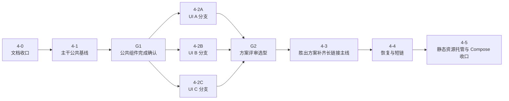

# Phase 4 细化计划

本文定义 [ROADMAP](../ROADMAP.md) 中 `Phase 4` 的推进顺序、当前已落地范围、并行 UI 分支策略与验收关口。界面结构、接口契约与业务规则仍分别以 [spec/02-frontend-spec](../spec/02-frontend-spec.md)、[spec/03-backend-api](../spec/03-backend-api.md)、[spec/04-business-rules](../spec/04-business-rules.md) 为准。

## 当前状态

- `Phase 4` 已开始，当前处于“共享主线收口”阶段
- 已初始化 `web/` 下的 `Vite + React + TypeScript + Tailwind CSS` 前端工程
- 已落地统一前端 domain types、字段级交互组件、共享流程主线与静态资源托管接线
- 已接入真实 `POST /api/stage1/convert -> stage2Init -> POST /api/generate -> longUrl` 主线
- 已接入 `resolve-url` 与 `short-links` 到共享页面状态主线
- 尚未完成 G1 共享业务层收口、A/B/C 方案分支评审与最终 Compose 单入口验证

## 主线业务路径

`Phase 4` 的业务主线固定为：

1. 可选地从既有 `longUrl` 或 `shortUrl` 恢复页面状态
2. 编辑阶段 1 输入并执行“转换并自动填充”
3. 在阶段 2 调整每个落地节点的 `mode` 与 `targetName`
4. 生成 `longUrl`
5. 可选创建 `shortUrl`
6. 打开、复制或下载当前选中的订阅链接

约束：

- `resolve-url` 只承担恢复入口，不形成独立业务阶段
- 前端不复制后端阶段 2 规则判定，只消费后端返回结果
- `longUrl` 始终是规范状态来源；`shortUrl` 只作为其别名

## 并行 UI 策略

本阶段采用“共享层先行，A/B/C 三分支并行探索，最终只保留 1 套方案”的策略。

共享层必须统一：

- `web/` 工程骨架与构建链
- API client 与 domain types
- `stage1Input`、`stage2Snapshot`、`generatedUrls`、`restoreStatus` 等页面状态模型
- 恢复、转换、生成、短链切换、过期态与只读冲突态的流程编排
- 错误/消息语义与后端契约映射
- 基础输入组件与目标选择所需的业务抽象接口
- 仅保留支撑恢复、Stage 1、Stage 2、Stage 3 数据交互所需的接口

允许 A/B/C 分化的层：

- 页面结构
- 信息架构
- 交互节奏
- 视觉呈现
- 阶段容器、消息容器、状态标签、目标选择器的具体 UI 实现
- Navbar、stepper/tab、品牌头图、主题切换等页面壳层

不允许 A/B/C 分化的层：

- 后端 API 契约
- 共享 domain model
- 错误语义
- Stage1/Stage2/Stage3 的业务边界

## 子阶段与关口

### 4-0：文档收口

目标：

- 固化 Phase 4 的共享层、分支策略、关口与验收顺序
- 保证后续实现都按同一份计划裁决

完成口径：

- `phase-4-breakdown`、`STATUS` 与相关导航对齐

### 4-1：主干公共基线

目标：

- 初始化 `web/` 前端工程
- 落地共享状态模型、domain types、字段级交互组件与共享流程编排
- 接入后端静态资源托管包装器与前端构建链

当前已完成：

- `web/` 工程骨架与生产构建
- SPA 静态资源托管包装器
- 输入组件与现有默认方案 UI
- 已将 Navbar、hero header、stepper 等页面结构从共享层剥离，避免提前冻结 A/B/C 方案
- 共享页面状态已接通 `resolve-url -> stage1/convert -> generate -> short-links`
- Stage 1 已补上高级菜单全量控件与手动 SOCKS5 追加入口
- Stage 2 已补上按 `chainTargets[].kind` 区分主路径与补充路径的默认方案选择器，空策略组保留展示但禁止选择
- `go test ./...` 与 `npm run build` 已通过

当前未完成：

- G1 共享业务层完成确认与统一前端验收场景固化
- A/B/C 方案评审与单入口部署验收

### G1：共享业务层完成确认

通过条件：

- 共享状态模型稳定
- API client 与 domain types 固定
- 共享层边界已收敛为业务数据交互接口：输入字段、错误/消息语义分发、状态与流程接口、节点目标选择抽象
- StageCard、NoticeStack、StatusPill 等强视觉组件已退出共享层，不保留参考实现地位
- Navbar、stepper/tab、品牌头图、主题切换等页面壳层不再属于共享层，由 A/B/C 分支自行决定
- 自动化 fixture 与基础演示场景可复用
- 静态资源托管和前端构建链可重复运行

### 4-2A / 4-2B / 4-2C：A/B/C 并行 UI 探索

目标：

- 从同一公共基线切出 `phase4-ui-a`、`phase4-ui-b`、`phase4-ui-c` 三个 Git 分支
- 在不改变共享业务边界的前提下，探索 3 套页面结构和交互方案

约束：

- 当前评审顺序是“先看设计方向，再补完整功能”
- 三条分支必须使用同一组演示场景与回归输入

### G2：方案评审选型

统一对比场景：

- 空白进入
- Stage1 输入
- Stage1 成功进入 Stage2
- Stage2 过期提示
- Stage3 链接展示位
- 错误态
- 桌面端与移动端阅读性

结论要求：

- 明确 1 套胜出方案
- 记录落选方案的问题与可吸收优点

### 4-3：胜出方案补齐长链接主线

目标：

- 打通 `stage1/convert -> stage2Init -> generate -> longUrl`
- 落地 Stage2 重建、Stage2 过期态、长链接展示与打开/复制/下载动作

### 4-4：恢复与短链

目标：

- 接入 `resolve-url`
- 接入 `short-links`
- 落地 `replayable | conflicted` 页面态与短链按需创建逻辑

### 4-5：静态资源托管与 Compose 收口

目标：

- 收口后端静态资源分发的正式路径
- 验证 `docker compose -f deploy/docker-compose.yml up --build -d` 下的单入口页面、API 与订阅路径

## 验证基线

1. 公共基线验证：`npm run build` 与 `go test ./...` 都通过
2. 主线闭环验证：真实跑通 `POST /api/stage1/convert -> POST /api/generate -> longUrl`
3. 恢复/短链验证：真实跑通 `resolve-url`、`short-links` 与短链订阅读取
4. 部署验证：Compose 单入口下页面、API、订阅与短链路径全部可访问

## 当前下一步

1. 完成 spec 与共享业务层边界同步，移除旧的共享视觉组件假设
2. 收口真实前端验收场景与演示数据，完成 G1 前的共享业务层确认
3. 在共享业务层稳定后进入 G1，并切出 A/B/C 三个 UI 分支