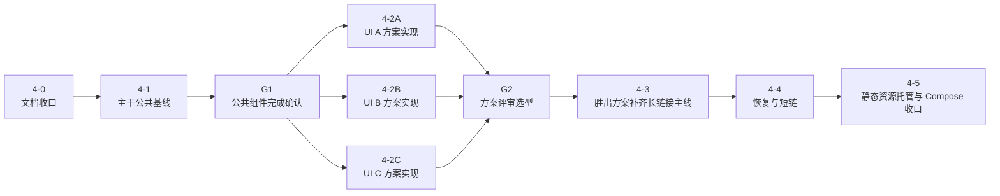

# Phase 4 细化计划

本文仅定义 [ROADMAP](../ROADMAP.md) 中 `Phase 4` 的推进顺序、并行 UI 策略、关口与验收口径。  
实时进度与已完成项统一维护在 [progress/STATUS](../progress/STATUS.md)。

在把 A/B/C 方案开发视为真正解阻前，先完成 [phase-4-dev-readiness](phase-4-dev-readiness.md) 中的本地预览、联调、连通性检测与 smoke 收口；本文继续只定义 UI 并行策略与关口。

界面结构、接口契约与业务规则分别以 [spec/02-frontend-spec](../spec/02-frontend-spec.md)、[spec/03-backend-api](../spec/03-backend-api.md)、[spec/04-business-rules](../spec/04-business-rules.md) 为准。

## 主线业务路径

`Phase 4` 的业务主线固定为：

1. 可选地从既有 `longUrl` 或 `shortUrl` 恢复页面状态
2. 编辑阶段 1 输入并执行“转换并自动填充”
3. 在阶段 2 调整每个落地节点的 `mode` 与 `targetName`
4. 生成 `longUrl`
5. 可选创建 `shortUrl`
6. 打开、复制或下载当前选中的订阅链接

约束：

- `resolve-url` 只承担恢复入口，不形成独立业务阶段
- 前端不复制后端阶段 2 规则判定，只消费后端返回结果
- `longUrl` 始终是规范状态来源；`shortUrl` 只作为其别名

## 并行 UI 策略

本阶段采用“共享层先行，A/B/C 三方案在同一仓库内并行探索，最终只保留 1 套方案”的策略。

共享层必须统一：

- `web/` 工程骨架与构建链
- API client 与 domain types
- `stage1Input`、`stage2Snapshot`、`generatedUrls`、`restoreStatus` 等页面状态模型
- 恢复、转换、生成、短链切换、过期态与只读冲突态的流程编排
- 错误/消息语义与后端契约映射，以及 `blockingErrors.scope` 到共享定位语义的映射
- 基础输入组件与目标选择所需的业务抽象接口
- 仅保留支撑恢复、Stage 1、Stage 2、Stage 3 数据交互所需的接口

允许 A/B/C 分化的层：

- 页面结构
- 信息架构
- 交互节奏
- 视觉呈现
- 阶段容器、消息容器、状态标签、目标选择器、全局错误承载区与局部阻断提示的具体 UI 实现
- Navbar、stepper/tab、品牌头图、主题切换等页面壳层

不允许 A/B/C 分化的层：

- 后端 API 契约
- 共享 domain model
- 错误语义
- Stage1/Stage2/Stage3 的业务边界

## 子阶段与关口

### 4-0：文档收口

目标：

- 固化 Phase 4 的共享层、方案并行策略、关口与验收顺序
- 保证后续实现都按同一份计划裁决

完成口径：

- `phase-4-breakdown`、`STATUS` 与相关导航对齐

### 4-1：主干公共基线

目标：

- 初始化 `web/` 前端工程
- 落地共享状态模型、domain types、字段级交互组件与共享流程编排
- 接入后端静态资源托管包装器与前端构建链

### G1：共享业务层完成确认

通过条件：

- 共享状态模型稳定
- API client 与 domain types 固定
- 共享层边界已收敛为业务数据交互接口：输入字段、错误/消息语义分发、状态与流程接口、节点目标选择抽象
- 共享前端入口已改为消费共享业务层接口，不再直接绑定默认方案组件
- 默认入口已不再占据共享入口地位，当前只保留 `a/b/c` 三套并行方案入口
- 已提供多套可装配的 `scheme` 入口用于验证共享入口可替换性；当前 `a/b/c` 都只共享业务契约，不共享 UI baseline
- Stage 1 端口转发输入快照已统一为 `forwardRelayItems: string[]`
- Stage 3 已完成单一当前链接输入框；反向解析、打开、复制、下载都消费同一输入值
- 全局阻断错误承载区保持单一入口，消息日志入口与局部定位提示语义稳定
- StageCard、NoticeStack、StatusPill 等强视觉组件已退出共享层，不保留参考实现地位
- Navbar、stepper/tab、品牌头图、主题切换等页面壳层不再属于共享层，由 A/B/C 方案层自行决定
- 自动化 fixture 与基础演示场景可复用，且需明确区分共享边界问题与外部模板/镜像漂移问题
- 静态资源托管和前端构建链可重复运行

### 4-2A / 4-2B / 4-2C：A/B/C 并行 UI 探索

目标：

- 在同一仓库内并行实现 `a`、`b`、`c` 三套方案入口（例如 `web/src/scheme/a|b|c`）
- 三套方案都只替换方案层实现，不改动共享 domain model、workflow、API client 与错误语义
- 在不改变共享业务边界的前提下，探索 3 套页面结构和交互方案

约束：

- 当前评审顺序是“先看设计方向，再补完整功能”
- 三套方案必须使用同一组演示场景与回归输入

### G2：方案评审选型

统一对比场景：

- 空白进入
- Stage1 输入
- Stage1 成功进入 Stage2
- Stage2 过期提示
- Stage3 链接展示位
- 错误态
- 桌面端与移动端阅读性

结论要求：

- 明确 1 套胜出方案
- 记录落选方案的问题与可吸收优点

### 4-3：胜出方案补齐长链接主线

目标：

- 打通 `stage1/convert -> stage2Init -> generate -> longUrl`
- 落地 Stage2 重建、Stage2 过期态、长链接展示与打开/复制/下载动作

### 4-4：恢复与短链

目标：

- 在最终方案中收口 `resolve-url` 与 `short-links` 的交互呈现
- 落地 `replayable | conflicted` 页面态与短链按需创建逻辑
- 确认 Stage 3 单一当前链接输入框在最终方案中的信息层级与动作编排

### 4-5：静态资源托管与 Compose 收口

目标：

- 收口后端静态资源分发的正式路径
- 验证 `docker compose -f deploy/docker-compose.yml up --build -d` 下的单入口页面、API 与订阅路径

## 验证基线

1. 公共基线验证：`npm run build` 与 `go test ./...` 都通过
2. 主线闭环验证：真实跑通 `POST /api/stage1/convert -> POST /api/generate -> longUrl`
3. 恢复/短链验证：真实跑通 `resolve-url`、`short-links` 与短链订阅读取
4. 部署验证：Compose 单入口下页面、API、订阅与短链路径全部可访问

## 当前下一步（计划视角）

1. 先按 [phase-4-dev-readiness](phase-4-dev-readiness.md) 收口本地预览、联调、连通性检测与 smoke 基线
2. 基于已确认共享边界，继续在同一仓库并行推进 A/B/C 三套 UI 方案
3. 以统一演示场景和手动 smoke 矩阵完成 G2 评审选型，并沉淀落选方案可复用结论
4. 在胜出方案内收口恢复、短链与 Compose 单入口部署验收