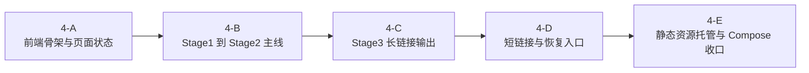

# Phase 4 细化计划

本文只定义 [ROADMAP](../ROADMAP.md) 中 `Phase 4` 的最小主线、非目标、实施顺序与验收口径；界面结构、接口契约与业务规则仍分别以 [spec/02-frontend-spec](../spec/02-frontend-spec.md)、[spec/03-backend-api](../spec/03-backend-api.md)、[spec/04-business-rules](../spec/04-business-rules.md) 为准。

## 当前前提

- `Phase 1-3` 已完成；后端主线固定为同一条 `3-pass` 转换管线
- `Phase 4` 只承接既有后端契约，不在此前端阶段额外扩展新的后端业务面
- 前端只消费 `stage2Init`、`messages[]`、`blockingErrors[]`、`longUrl`、`shortUrl`、`restoreStatus`

## 主线业务路径

`Phase 4` 的主线固定为：

1. 可选地从既有 `longUrl` 或 `shortUrl` 恢复页面状态
2. 编辑阶段 1 输入并执行“转换并自动填充”
3. 在阶段 2 调整每个落地节点的 `mode` 与 `targetName`
4. 生成 `longUrl`
5. 可选创建 `shortUrl`
6. 打开、复制或下载当前选中的订阅链接

约束：

- `resolve-url` 只是主线的恢复入口，不单独形成新的业务阶段
- 前端不复制后端的阶段 2 规则判定，只消费后端返回结果
- `longUrl` 始终是规范状态来源；`shortUrl` 只作为其别名

## 非目标

- 不在 `Phase 4` 新增业务规则、第二套快照模型或新的后端端点
- 不引入 SSR、`Next.js`、多页路由、全局状态框架或额外 BFF
- 不把 `completeConfig`、`baseCompleteConfig` 或 `3-pass` 中间结果保存在前端
- 不把主题切换、GitHub 跳转、视觉润色当作主线闭环验收前置条件
- 不在前端阶段继续扩张 review case 与 fixture 规模；新增样例必须服务真实回归风险
- 不扩展 `app + subconverter + SQLite` 之外的默认部署拓扑

## 子阶段划分

## 4-A：前端骨架与页面状态

目标：

- 初始化 `web/` 下的 `Vite + React + TypeScript` 单页工程
- 建立单页状态主线：`stage1Input`、`stage2Snapshot`、`generatedUrls`、`restoreStatus`
- 默认采用同源 API 访问；不先引入额外代理层或复杂环境拆分

约束：

- 默认使用页面局部状态和轻量请求状态；没有明确痛点前不引入全局 store
- 不在前端缓存 `completeConfig`

验收：

- 页面可启动并渲染空白业务壳
- API 基础调用方式明确且与现有部署口径一致

## 4-B：Stage1 到 Stage2 主线

目标：

- 落地阶段 1 输入区与“转换并自动填充”动作
- 直接按后端返回的 `stage2Init` 渲染阶段 2
- 当阶段 1 输入变化时，正确使阶段 2 过期

约束：

- 前端不自行推导 `availableModes`、`restrictedModes`、`chainTargets[]`、`forwardRelays[]`
- 阶段 2 只维护用户选择结果，不重算业务默认值

验收：

- 能基于真实 `POST /api/stage1/convert` 进入阶段 2
- 阶段 2 的禁用态、默认值与错误展示均以后端返回为准

## 4-C：Stage3 长链接输出

目标：

- 落地“生成链接”动作与阶段 3 长链接展示
- 支持打开、复制、下载当前长链接

约束：

- 前端不主动抓取 YAML 内容；操作按钮直接消费订阅链接
- 长链接成功后才进入阶段 3；失败时保留在阶段 2

验收：

- Happy path 可完成“输入 -> 转换 -> 调整 -> 生成长链接 -> 打开/下载订阅”

## 4-D：短链接与恢复入口

目标：

- 在长链接主线稳定后，再接入短链接开关与 `POST /api/short-links`
- 提供单一页面恢复入口，消费 `POST /api/resolve-url`
- 支持 `restoreStatus = replayable | conflicted`

约束：

- 短链接只在用户首次显式开启时创建
- 恢复入口只接受已有 `longUrl` 或 `shortUrl`，不引入其他导入格式
- `conflicted` 只读态必须由后端结果驱动，不由前端猜测

验收：

- 可从既有链接恢复页面
- `replayable` 与 `conflicted` 两条恢复路径都可正确呈现

## 4-E：静态资源托管与 Compose 收口

目标：

- 由后端统一托管前端构建产物，形成单入口运行形态
- 收口 `cmd/server` 的静态资源分发与 `deploy/docker-compose.yml` 的正式口径

约束：

- 默认仍保持 `app + subconverter` 两服务拓扑，并保留 SQLite 卷持久化
- 不额外引入 `nginx`、Redis、外部数据库或消息队列

验收：

- `docker compose -f deploy/docker-compose.yml up --build -d` 可跑通前后端单入口路径
- 页面、API、订阅链接与短链订阅在同一部署口径下可工作

## 建议顺序

| 顺序 | 子阶段 | 说明 |
|------|--------|------|
| 1 | 4-A | 先固定页面状态模型与同源访问口径 |
| 2 | 4-B | 先打通 `stage1/convert -> stage2`，不要一开始做恢复与短链 |
| 3 | 4-C | 先交付长链接主线，再引入短链别名 |
| 4 | 4-D | 以既有后端 `resolve-url` 接入恢复能力 |
| 5 | 4-E | 最后收口静态资源托管与正式 Compose |

补充：

- `4-B` 到 `4-C` 构成 `Phase 4` 的最小业务闭环
- `4-D` 与 `4-E` 不应反向牵动新的后端业务扩展；若需要新增规则，先回到 spec 澄清