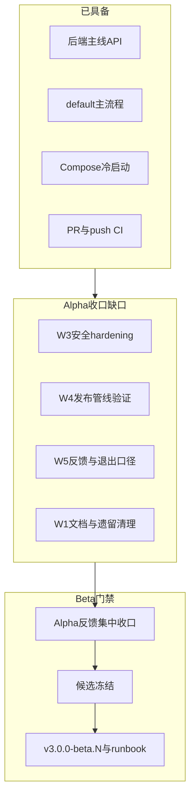
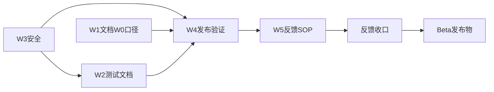

# Beta 发布缺口评估

> 最近更新：2026-05-14

本文记录 3.0 距 Beta 发布的缺口评估与推荐推进顺序。实时阶段状态仍以 [STATUS.md](STATUS.md) 为准；Alpha 收口执行细节见 [plan/3.0-alpha-cutover.md](../plan/3.0-alpha-cutover.md)。

## 当前基线

- **阶段**：对外口径为 **3.0 Alpha**（[RELEASES.md](../../RELEASES.md)、[STATUS.md](STATUS.md)）；**尚未进入 Beta 候选冻结**。
- **发布线**：`main` / `dev` / `release/3.0`；Alpha、Beta、GA 拟用 `v3.0.0-alpha.N` / `v3.0.0-beta.N` / `v3.0.0` 区分（[plan/3.0-alpha-cutover.md](../plan/3.0-alpha-cutover.md)）。
- **对外 UI**：默认 `/` → `default` scheme；`/ui/a|b|c` 为实验入口。**Beta 验收以 default 为主，A/B/C 不阻塞**。
- **已较稳定**：后端主线 API、共享业务层主流程、Compose 单段部署、SPA 托管、[ci.yml](../../.github/workflows/ci.yml)（`go test`、四 scheme 构建、compose config）、部分 HTTP 加固（JSON body 上限、服务读写超时）。

## 距 Beta 仍须完成的工作

### 1. Alpha 收口（[plan/3.0-alpha-cutover.md](../plan/3.0-alpha-cutover.md) W0–W5）

Beta 在计划里**不单独做功能开发**；[3.0-alpha-cutover.md §7](../plan/3.0-alpha-cutover.md) 写明本轮只预埋 Beta tag 与退出标准。因此 **Beta 前置 = 本计划未完成的 Alpha 项 + 反馈收口 + Beta 发布物**。

| 工作流 | 完成度 | 阻塞 Beta 的剩余项 |
|--------|--------|-------------------|
| **W0** 发布线 | 部分 | 全仓 `alpha` 分支叙述与 [STATUS.md](STATUS.md) 缺口描述对齐 [ci.yml](../../.github/workflows/ci.yml) / [docker-publish.yml](../../.github/workflows/docker-publish.yml)；预埋 `beta-latest` 或等价 Beta 镜像策略 |
| **W1** 文档 | 部分 | `phase-4-*` 归档出主导航；[_legacy/](../../_legacy/) 迁出；[SECURITY.md](../../SECURITY.md) 与 W3 落地后一致 |
| **W2** 测试 | 部分 | 在 [docs/testing/](../testing/) 写清 unit / contract / smoke 分层；[alpha-release.md](../testing/alpha-release.md) 发布前检查与 CI 统一为 `build:default/a/b/c` |
| **W3** 安全 | **部分已做** | SSRF 最小拦截与 `RequirePublicBaseURL` 已落地；剩余四 API 限速、Compose subconverter 网络隔离、更严格出站控制与 [deploy/README.md](../../deploy/README.md) 安全专节补全 |
| **W4** 发布验证 | 未记录 | 干净设备 + **不可变 tag** 冷启动；default 主线 + 四入口连通；写入 [STATUS.md](STATUS.md)「最近验证」 |
| **W5** 反馈 SOP | 未做 | [.github/ISSUE_TEMPLATE/](../../.github/ISSUE_TEMPLATE/)；[alpha-release.md](../testing/alpha-release.md) 补 **Alpha → Beta 退出口径** |

**W3 为 Beta 硬门槛**：[SECURITY.md](../../SECURITY.md) 与 W5.2 均把 SSRF、`PUBLIC_BASE_URL` 生产配置稳定性列为 Beta 前置；[ROADMAP.md](../ROADMAP.md) 亦将安全口径单列跟踪。

**W4 为 Beta 硬门槛**：无不可变 tag 的第三方端到端记录，则无法证明 Compose 与镜像 tag 节奏可复现。

### 2. Alpha 反馈与 Beta 候选冻结（尚无独立 spec）

[STATUS.md](STATUS.md)：**Alpha 反馈未集中收口，未进入 Beta 候选冻结**。W5.2 拟议退出口径（待写入 runbook）：

- 连续多周回归无 **P0**
- W3 安全配置在**生产式部署**下稳定
- 默认 `/` 不再依赖临时变更；A/B/C 职责边界清晰（实验入口，不阻塞）

**尚缺**：P0 定义、回归周期 N、反馈台账载体（issue 模板 + 按 [alpha-release.md](../testing/alpha-release.md) 字段归档）。

### 3. Beta 发布物（计划仅预埋 tag）

| 项 | 现状 |
|----|------|
| `v3.0.0-beta.N` | 文档有规则；**无** Beta 章节于 [RELEASES.md](../../RELEASES.md) |
| `beta-latest` | 计划提及；[docker-publish.yml](../../.github/workflows/docker-publish.yml) **无** 对应 job |
| Beta runbook | **无** `docs/testing/beta-release.md` 或等价文档 |
| 镜像发布 | `release/3.0` push → `alpha-latest`；tag job 面向 semver + `dev-latest`（含 Render），**未**区分 beta tag 便捷标签 |

Beta 候选冻结后需补：**Beta 发布说明、最小回归（可继承 Alpha 并收紧）、不可变 tag 绑定、可选 `beta-latest`**。

### 4. 工程与质量债（不单独阻塞 default Beta，但影响信心）

- **文档与实现不同步**：[3.0-alpha-cutover.md §1](../plan/3.0-alpha-cutover.md) 仍写「无 PR 守门」；[phase-4-dev-readiness.md](../temp/completed-phases/phase-4-dev-readiness.md) 仍含 `alpha` 分支旧口径。
- **测试深度**：无覆盖率门禁、无前端单测/E2E；[docker-publish](../../.github/workflows/docker-publish.yml) 构建前不跑测试。
- **依赖浮动**：[deploy/docker-compose.yml](../../deploy/docker-compose.yml) 中 `subconverter:integration-chain-subconverter` 浮动 tag；计划要求 runbook 记录**已验证版本与回滚**（不强制 digest）。
- **前端体验债**：B/C 的 workflow log 与 default 不一致（[STATUS.md](STATUS.md)）；**不阻塞 Beta**。

### 5. 明确不在 Beta 范围（与 [RELEASES.md](../../RELEASES.md) / cutover §7 一致）

- i18n、移动端专项适配、内建鉴权
- 重写 [docs/spec/02–04](../spec/)
- 强制 subconverter 镜像 digest 锁定（仅文档化已验证来源）

## 推荐推进顺序

1. **W3 安全** → 更新 [SECURITY.md](../../SECURITY.md) 与 [deploy/README.md](../../deploy/README.md)
2. **W2 测试分层** + 修正 [alpha-release.md](../testing/alpha-release.md) 与 CI 一致
3. **W1 文档/遗留** + **W0 发布线口径** 全仓对齐
4. **W4** 不可变 Alpha tag 第三方冷启动 + default 主线回归（四入口连通作记录）
5. **W5** issue 模板 + **Alpha → Beta 退出口径** 成文
6. **Alpha 反馈集中收口** → **Beta 候选冻结**（P0 清零、生产配置稳定）
7. **Beta 发布物**：`RELEASES` Beta 节、`beta-release` runbook、`v3.0.0-beta.1` 与镜像策略

## Beta 完成定义（建议）

- [release/3.0](../../.github/workflows/docker-publish.yml) 上存在 **`v3.0.0-beta.N`**，回归绑定**不可变 tag**
- W3 项在代码与部署文档中可核对；生产式部署下 `PUBLIC_BASE_URL`/SSRF 边界明确
- 第三方设备可按 [deploy/README.md](../../deploy/README.md) 冷启动并完成 default 最小回归
- Alpha 反馈已归档，无未关闭 P0；[RELEASES.md](../../RELEASES.md) 与 Beta runbook 对外口径一致
- A/B/C 保持实验入口，不纳入 Beta 对外承诺

## 相关文档

- 当前状态快照：[STATUS.md](STATUS.md)
- Alpha 收口执行计划：[plan/3.0-alpha-cutover.md](../plan/3.0-alpha-cutover.md)
- Alpha 发布与回归：[testing/alpha-release.md](../testing/alpha-release.md)
