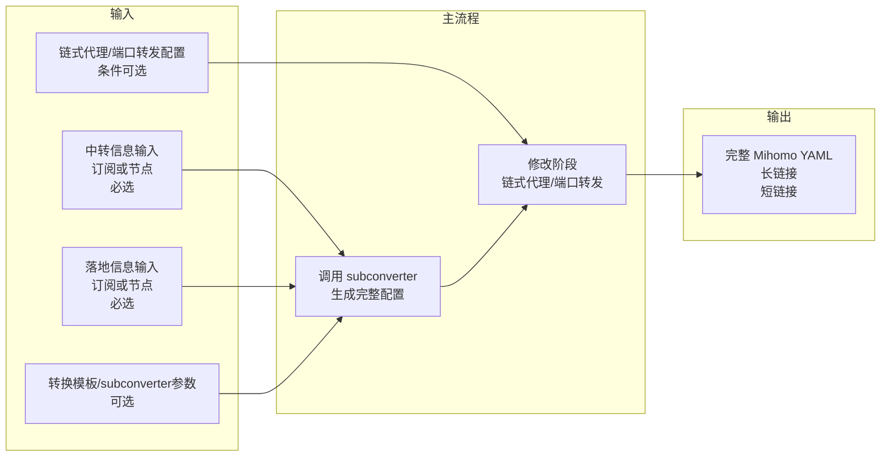
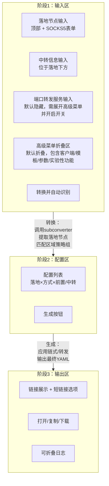

# 01 - 项目概览

## 当前阶段

本项目处于 **spec-driven 的彻底重构阶段**。治理与权威顺序见 [00-governance](00-governance.md)。

## 项目目标与核心价值

帮助**新手和懒人用户**基于已有的**落地节点**和**中转节点**信息，通过 Web 前端完成 **Mihomo** 的**链式代理**和**端口转发**配置生成与输出。

项目整合 **subconverter + 链式代理/端口转发配置**两部分功能，前后端一体，整合 subconverter 代码。通常用于**内网/公网自行部署**使用。

## 核心设计理念

- **面向新手/懒人用户**：引导式三阶段流程，减少用户操作和理解门槛
- **三阶段流水线 UI**：输入区 → 配置区 → 输出区，分步引导
- **单一生成路径**：统一通过 subconverter 生成完整配置，不做路径分流
- **前后端整合**：单一部署单元，整合 subconverter 代码，前端直接调用后端 API
- **输入职责清晰**：所有原始节点/订阅输入都在阶段 1 完成；阶段 2 仅基于转换结果做选择与调整

## 数据流概览

## 三阶段 UI 流程

## 关键术语

| 术语 | 定义 |
|------|------|
| 落地节点（Landing Node） | 最终出口节点，流量从此节点离开到达目标。来源于阶段 1 落地输入区中的全部输入项经转换后的结果；若输入订阅 URL，则该订阅展开后的全部节点都属于落地节点 |
| 中转节点（Transit Node） | 流量中继节点，作为落地节点的前置代理。由用户在中转信息输入区提供 |
| 端口转发服务（Port Forward Relay） | `server:port` 格式的转发服务地址，用于替换落地节点的连接地址；仅在开启实验性端口转发功能后录入，且不进入 subconverter |
| 链式代理（Chain Proxy） | 通过 Mihomo `dialer-proxy` 实现 中转→落地 的代理链路 |
| 端口转发（Port Forward） | 仅将落地节点的 `server` 与 `port` 替换为端口转发服务地址，不修改其他字段 |
| 完整配置（CompleteConfig） | subconverter 生成的包含通用配置 + 节点集合的 Mihomo YAML |
| 转换模板（Template） | subconverter 使用的配置模板，决定规则、策略组等结构；当前阶段仅支持固定默认模板，暂不支持自定义模板 |
| 策略组（Proxy Group） | Mihomo 中的 proxy-group，用于分组和选择节点。默认模板生成 6 个区域策略组 |
| 区域策略组 | 由默认模板按区域分类的策略组：香港、美国、日本、新加坡、台湾、韩国 |

## 关键业务约束

- **阶段 1 是唯一原始输入入口**：节点链接、订阅 URL、手动添加的 SOCKS5 节点都必须在阶段 1 输入；阶段 2 不允许自由手填节点
- **阶段 2 固定为一节点一行**：自动识别后默认每个落地节点一条配置；同一落地节点在阶段 2 不能出现多行
- **阶段 2 不提供行级复制或建节点能力**：不支持重新选择落地节点、不支持复制本行、不支持 `+/-` 行、不支持创建新节点
- **落地副本只能在阶段 1 创建**：如需同一节点的多个副本，必须在落地输入区自行复制多条 URI；完全一致的 URI 需在识别后自动追加 ` 02`、` 03` 等后缀
- **端口转发为实验性次要功能**：默认隐藏；需先展开高级菜单，再开启端口转发开关后，端口转发输入区才显示
- **端口转发独立输入**：端口转发信息独立于中转节点输入区，且不进入 subconverter
- **链式代理写入 `dialer-proxy`**：第三列可选单个策略组或节点；生成时将所选值直接写入落地节点的 `dialer-proxy`
- **链式代理不支持 `vless-reality` 落地节点**：按转换后 `proxies` 的协议参数判断
- **`vless-reality` 允许直接做端口转发**：端口转发只替换 `server` 与 `port`，不要求复制新节点
- **链式代理端口提示仅为推荐信息**：当落地节点端口号大于等于 `10000` 时，仅提示推荐优先使用 `10000` 以内端口，不作为警告或阻断
- **阶段 3 的长链接编码最小快照**：必须包含阶段 1 输入和阶段 2 配置；短链接只是长链接的后端别名
- **消息使用统一结构化模型**：普通日志与 warning 统一进 `messages[]`，阻断错误单独用 `blockingErrors[]`
- **默认模板固定**：阶段 1 到阶段 3 的自动识别逻辑均依赖默认模板生成的 6 个区域策略组

## 文档结构

| 文档 | 说明 |
|------|------|
| [00-governance](00-governance.md) | 治理与总则 — 当前阶段、核心规则、权威顺序 |
| [01-overview](01-overview.md) | 本文档 — 项目目标、数据流、术语、约束 |
| [02-frontend-spec](02-frontend-spec.md) | 前端 UI 规格 — 三阶段界面、状态与交互语义 |
| [03-backend-api](03-backend-api.md) | 后端 API 契约 — 阶段产物、生成接口、长短链接与消息模型 |
| 04-business-rules（待补） | 业务规则 — 生成与修改逻辑 |
| 05-tech-stack（待补） | 技术选型与项目结构 |
