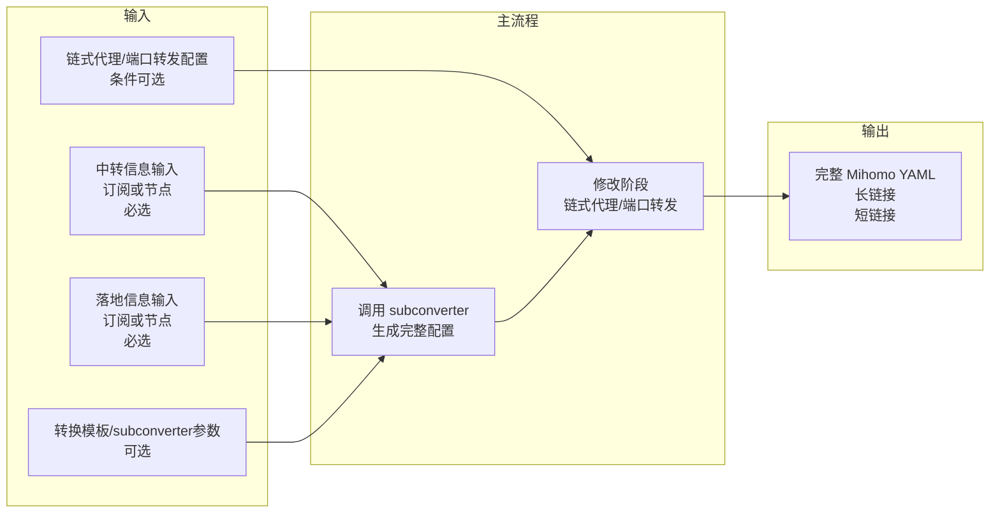
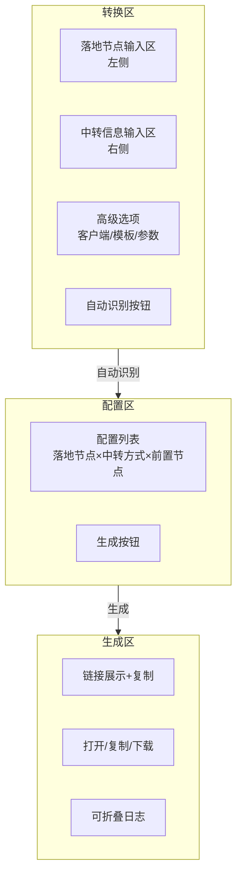

# 01 - 项目概览

## 当前阶段声明：Spec-driven 彻底重构

本项目当前处于 **spec-driven 的彻底重构阶段**：任何既有架构、代码、逻辑、文档与历史决策都可以被质疑；spec 中遇到歧义或隐含假设时，必须提出澄清要求；同时鼓励提出更优实现与最佳实践，并最终以 spec 的结论作为唯一准绳。

## 项目目标与核心价值

帮助**新手和懒人用户**基于已有的**落地节点**和**中转节点**信息，通过 Web 前端完成 **Mihomo** 的**链式代理**和**端口转发**配置生成与输出。

项目整合 **subconverter + 链式代理/端口转发配置**两部分功能，前后端一体。通常用于**内网/公网自行部署**使用。

## 核心设计理念

- **面向新手/懒人用户**：前端引导式流程，减少用户需要理解的概念和操作步骤
- **三阶段流水线 UI**：转换区 → 配置区 → 生成区，分步引导
- **单一生成路径**：统一走 subconverter 生成完整配置，不做路径分流
- **前后端整合**：单一部署单元，前端直接调用后端 API

## 数据流概览

## 三阶段 UI 流程

## 关键术语

| 术语 | 定义 |
|------|------|
| 落地节点（Landing Node） | 最终出口节点，流量最终从此节点离开到达目标 |
| 中转节点（Transit Node） | 流量中继节点，作为落地节点的前置代理 |
| 链式代理（Chain Proxy） | 通过 Mihomo `dialer-proxy` 实现 中转→落地 的代理链路 |
| 端口转发（Port Forward） | 将落地节点的 `server:port` 替换为端口转发服务地址 |
| 完整配置（CompleteConfig） | subconverter 生成的包含通用配置 + 节点集合的 Mihomo YAML |
| 转换模板（Template） | subconverter 使用的配置模板，决定规则、策略组等结构 |
| 策略组（Proxy Group） | Mihomo 中的 proxy-group，用于分组和选择节点 |

## 文档结构

| 文档 | 说明 |
|------|------|
| [01-overview](01-overview.md) | 本文档 — 项目目标、数据流、术语 |
| [02-frontend-spec](02-frontend-spec.md) | 前端 UI 规格 — 三阶段界面详细设计 |
| 03-backend-api（待补） | 后端 API 契约 |
| 04-business-rules（待补） | 业务规则 — 生成与修改逻辑 |
| 05-tech-stack（待补） | 技术选型与项目结构 |
