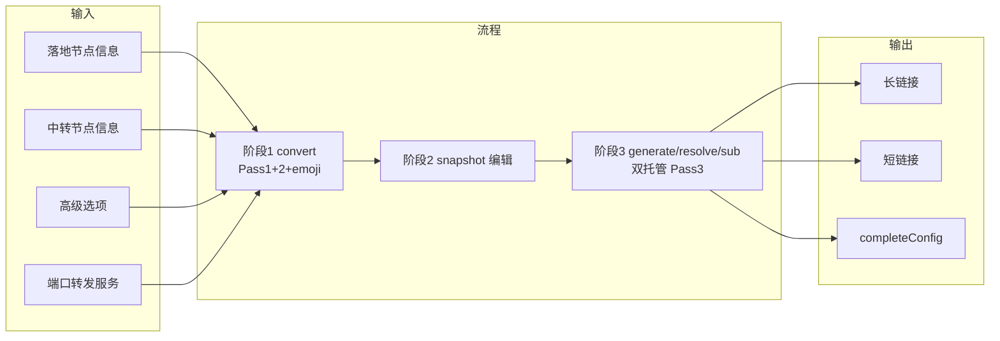

# 01 - 项目概览

## 项目目标

帮助用户基于已有的**落地节点**和**中转节点**信息，通过 Web 前端完成 **Mihomo** 的**链式代理**与**端口转发**配置生成，并输出可直接消费的长链接和可选短链接。

项目采用前后端一体化部署，统一整合 `subconverter`，通常用于内网或公网自部署。

## 核心设计原则

- **三阶段固定流程**：阶段 1 输入、阶段 2 配置、阶段 3 输出
- **统一 Pipeline（hard-break）**：`convert` 只执行至 `buildStage2Init`；`generate`、`resolve` 与 `GET /sub*` 必须执行同一条完整 Pipeline（含双托管 Pass 3）；步骤表见 [04 §1.1.1](04-business-rules.md)
- **单一状态载荷**：长链接仅承载 `statePayload v4`，不接受旧版本载荷与外层 query 覆写
- **最终配置延迟交付**：`convert` 与 `generate` 不返回 YAML；`completeConfig` 只在订阅链接被打开或下载时即时生成
- **输入职责清晰**：所有原始输入在阶段 1 完成；阶段 2 只编辑 `stage2Snapshot`
- **恢复可裁决**：`resolve` 只返回 `replayable` 或 `conflicted`；`conflicted` 仅允许只读恢复

## 数据流概览

订阅读取（`GET /sub*`）在 Pass 3 前同时托管 **ManagedLanding**（snapshot 合并）与 **ManagedTransitProxies**（Pass 2 emoji 后 `proxies[]` 片段）；不向 Pass 3 透传原始 `transitRawText`。步骤定义见 [04 §1.1.1](04-business-rules.md)。

## 三阶段职责

| 阶段 | 职责 |
|------|------|
| 阶段 1：输入区 | 收集 `stage1Input`；执行 `pass1Discover` + `pass2Discover` + `applyEmoji` 并产出 `stage2Init` |
| 阶段 2：配置区 | 基于 `stage2Init` 编辑 `stage2Snapshot`（复制、改名、模式与目标、聚合组）；通过主按钮发起 `generate` |
| 阶段 3：输出区 | `generate` 产出规范长链接；`resolve` 恢复并裁决可重放性；`GET /sub`/`GET /sub/<id>` 经双托管 Pass 3 即时渲染 `completeConfig` |

## 关键术语

| 术语 | 定义 |
|------|------|
| 落地节点（Landing Node） | 最终出口节点，来自 Pass 1 `proxies[].name` |
| 中转节点（Transit Node） | 作为前置代理使用的节点或策略组来源，来自 Pass 2 与模板识别 |
| 端口转发服务（Port Forward Relay） | `server:port` 字面量；仅用于 `mode = port_forward`，不进入 `subconverter` |
| 模板 URL（Template URL） | `stage1Input.advancedOptions.config` 的业务语义；指定本次转换使用的远程模板来源 |
| 模板内容（TemplateConfig） | 后端拉取、校验并托管后的模板文本；用于地域策略组识别与转换 |
| 节点 emoji 处理 | `emoji = true` 时在 Pass 1/2 后、`buildStage2Init` 前执行的链路内命名改写；处理 Pass 1 与 Pass 2 的 `proxies[].name` |
| 托管 landing（ManagedLanding） | Pass 3 前按 `stage2Snapshot` 合并的落地 `proxies[]` YAML；经内部短链传入 Pass 3 |
| 托管 transit proxies（ManagedTransitProxies） | Pass 2 emoji 处理后的 transit `proxies[]` 片段；仅 `proxies:` 段、不含 `proxy-groups`；经内部短链传入 Pass 3 |
| 阶段 2 初始化数据（Stage2Init） | `convert` 返回的初始化结果，包含 `availableModes`、候选列表与默认行 |
| 阶段 2 配置快照（Stage2Snapshot） | 用户可编辑快照；`rowId` 是行主键，`sourceLandingNodeName` 是连接参数绑定键，`proxyName` 是最终 YAML 节点名 |
| 状态载荷（StatePayload v4） | 长链接 `data` 解码后的唯一规范结构，仅包含 `stage1Input` 与 `stage2Snapshot` |
| 恢复状态（RestoreStatus） | `resolve` 的裁决结果：`replayable` 可继续编辑/生成，`conflicted` 仅可只读查看 |
| 原因参数（ReasonArgs） | 与 `reasonCode` 配套的结构化参数；文案由前端本地映射 |

## 全局约束

- 阶段 1 是唯一原始输入入口；阶段 2 不允许自由手填节点或服务
- `stage2Init` 每落地一行；`stage2Snapshot` 可含复制行，`rowId` 与 `proxyName` 全表唯一
- 端口转发输入独立于中转输入，且不参与 `subconverter`
- `resolve` 返回 `conflicted` 时，页面必须进入只读冲突态，不得继续 `generate`
- 规范长链接仅接受 `data`（以及订阅读取时可选 `download=1`），不接受状态覆写 query
- 规则定义在 [04-business-rules](04-business-rules.md)；HTTP 契约定义在 [03-backend-api](03-backend-api.md)
