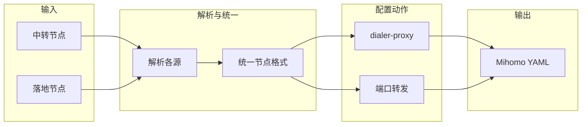

# 01 - 项目概览

## 项目目标

为 **Mihomo** 配置文件添加**链式代理**和/或**端口转发**配置，打通 Mihomo 中转配置最后一公里。

## 范围限定

- **仅针对 Mihomo 内核**：暂不涉及 Surge、Quantumult X 等其他内核
- **配置结构**：遵循 Mihomo 的 `proxies`、`proxy-groups`、`proxy-providers`、`rules` 等结构

## 核心价值

- 用户提供**中转节点**与**落地节点**的多种输入形式
- 系统统一解析为 Mihomo 节点格式，并生成链式代理 / 端口转发配置
- 输出完整的 Mihomo YAML 或订阅链接

## 数据流概览

## 与前置条件的依赖

项目成功运行需满足：

1. **中转节点**：至少有一种形式的中转节点输入（详见 [02-prerequisites](02-prerequisites.md)）
2. **落地节点**：至少有一种形式的落地节点输入（详见 [02-prerequisites](02-prerequisites.md)）
3. 两者最终均被转换为 Mihomo 的 `proxies` 列表项格式
