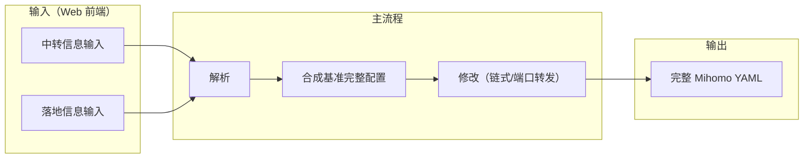

# 01 - 项目概览

## 当前阶段声明：Spec-driven 彻底重构

本项目当前处于 **spec-driven 的彻底重构阶段**：任何既有架构、代码、逻辑、文档与历史决策都可以被质疑；遇到歧义或隐含假设时，必须在 spec 中提出并要求澄清；同时鼓励提出更优实现与最佳实践，并以 spec 的结论作为唯一准绳。

## 项目目标

帮助用户基于其**已有信息**（订阅/YAML/节点/中转机 `server:port` 等），通过 **Web 前端**集中完成 **Mihomo** 的**链式代理**和/或**端口转发**配置生成与输出，避免用户手动编辑 YAML 或进行任何代码操作。

## 范围限定

- **仅针对 Mihomo 内核**：暂不涉及 sing-box、Xray 等其他内核
- **配置结构**：遵循 Mihomo 的 `proxies`、`proxy-groups`、`proxy-providers`、`rules` 等结构

## 核心价值

- 用户通过 Web 前端提供两份信息：**中转信息输入**与**落地信息输入**（形式多样：订阅/YAML/节点-only/节点链接/填表等）
- 系统先解析并判定是否包含**完整 Mihomo 配置**；当缺少完整配置时，使用内置订阅转换服务生成可用的完整配置骨架
- 在统一节点格式后，按用户指定方式生成**链式代理**和/或**端口转发**改写
- 输出可直接供 Mihomo 使用的完整 YAML（可选订阅链接）

## 数据流概览

## 与前置条件的依赖

输出完整 Mihomo YAML 的**输入依赖**与**约束**统一在 [02-prerequisites](02-prerequisites.md) 维护；本篇仅描述目标、范围与数据流。
