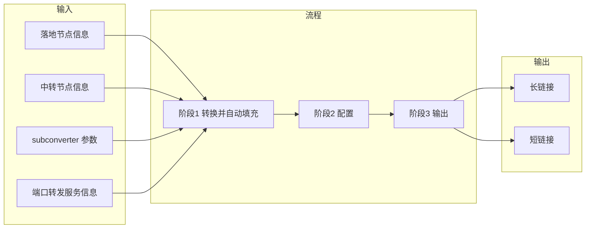

# 01 - 项目概览

## 项目目标

帮助用户基于已有的**落地节点**和**中转节点**信息，通过 Web 前端完成 **Mihomo** 的**链式代理**与**端口转发**配置生成，并输出可直接消费的长链接和可选短链接。

项目采用前后端一体化部署，统一整合 `subconverter`，通常用于内网或公网自部署。

## 核心设计原则

- **三阶段固定流程**：阶段 1 输入，阶段 2 配置，阶段 3 输出
- **统一转换管线**：阶段 1、生成校验、恢复判定与订阅渲染都复用同一条 3-pass 转换管线
- **最终配置延迟交付**：阶段 1 与 `generate` 只产出初始化结果或链接；最终 `completeConfig` 只在订阅链接实际被打开或下载时即时生成
- **输入职责清晰**：所有原始输入都在阶段 1 完成；阶段 2 只基于转换结果做选择
- **默认模板驱动**：当前自动识别逻辑以默认模板生成的 6 个区域策略组为前提
- **快照可复现**：阶段 3 长链接必须能够完整恢复阶段 1 和阶段 2 的状态；恢复后的后续操作权限以后端恢复校验结果为准

## 数据流概览

## 三阶段职责

| 阶段 | 职责 |
|------|------|
| 阶段 1：输入区 | 收集落地节点信息、中转节点信息、`subconverter` 参数、端口转发服务信息；执行统一转换管线；生成阶段 2 初始化数据 |
| 阶段 2：配置区 | 以“每个落地节点一行”的方式展示配置；根据自动识别结果给出默认值；允许用户调整 `mode` 和第三列目标；通过主按钮发起“生成链接” |
| 阶段 3：输出区 | 展示长链接与可选短链接，并提供基于链接的打开、复制、下载操作 |

## 关键术语

| 术语 | 定义 |
|------|------|
| 落地节点（Landing Node） | 最终出口节点。阶段 2 第一列的数据来源 |
| 中转节点（Transit Node） | 作为前置代理使用的节点或策略组来源 |
| 端口转发服务（Port Forward Relay） | `server:port` 格式的服务地址；仅用于端口转发，不进入 `subconverter` |
| 基底完整配置（BaseCompleteConfig） | `full-base pass` 生成并经后端后处理后的内部基底配置；仅供校验与订阅渲染使用，不直接暴露给前端 |
| 完整配置（CompleteConfig） | 订阅链接被打开或下载时，后端基于当前 `baseCompleteConfig` 应用阶段 2 快照改写后即时返回的最终 Mihomo YAML |
| 区域策略组 | 默认模板提供的 6 个区域组：香港、美国、日本、新加坡、台湾、韩国 |
| 阶段 2 初始化数据（Stage2Init） | 阶段 1 返回的、供前端直接渲染配置区的数据，包括落地节点、模式可选项、链式候选、中转候选和默认行 |

## 全局约束

- 阶段 1 是唯一原始输入入口；阶段 2 不允许自由手填节点或服务
- 阶段 2 固定为一节点一行；同一落地节点不能出现多行
- 落地副本只能在阶段 1 创建；完全一致的 URI 需要稳定重命名
- 端口转发输入独立于中转输入，且不参与 `subconverter`
- 阶段 2 的自动识别、候选收集、生成前校验与改写规则统一定义在 [04-business-rules](04-business-rules.md)
- 前端只负责渲染和交互；接口字段与消息结构以 [03-backend-api](03-backend-api.md) 为准
