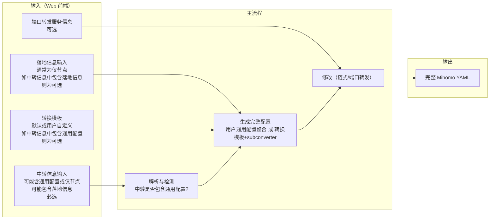

# 01 - 项目概览

## 当前阶段声明：Spec-driven 彻底重构

本项目当前处于 **spec-driven 的彻底重构阶段**：任何既有架构、代码、逻辑、文档与历史决策都可以被质疑；spec中遇到歧义或隐含假设时，必须提出澄清要求；同时鼓励提出更优实现与最佳实践，并最终以 spec 的结论作为唯一准绳。

## 项目目标与核心价值

帮助用户基于其**已有信息**（订阅/YAML/节点/中转机 `server:port` 等），通过 **Web 前端**集中完成 **Mihomo** 的**链式代理**和/或**端口转发**配置生成与输出：系统自动解析输入、自动检测中转信息是否包含**通用配置**（见下文术语），必要时通过 **转换模板 + subconverter** 生成**完整配置**，随后按用户指定方式完成改写并输出可直接供 Mihomo 使用的最终 YAML（可选提供订阅链接或 YAML 文件下载），避免用户手动编辑 YAML 或进行任何代码操作。范围上仅针对 Mihomo 内核，暂不涉及 sing-box、Xray 等其他内核。

## 关键术语（概览）

- **通用配置（GeneralConfig）**：使 Mihomo 可运行并支撑后续改写的最小非节点结构，必须包含：`mixed-port` 或 `port`、`mode`、`external-controller`、`proxy-groups`、`rules`。
- **转换模板（Template）**：用于生成/补齐通用配置，提供 rules 和 proxy-groups 策略（有默认转换模板，也允许用户自定义）。
- **完整配置（CompleteConfig）**：`通用配置 + 节点集合`，是后续修改的基础。

## 数据流概览

## 与前置条件的依赖

完整配置的生成规则（通用配置判定、转换模板选择、subconverter 路径等）见 [02-generate-complete-config](02-generate-complete-config.md)；修改规则见 [03-modify-config](03-modify-config.md)；接口与输出契约见 [04-output-and-api](04-output-and-api.md)。
