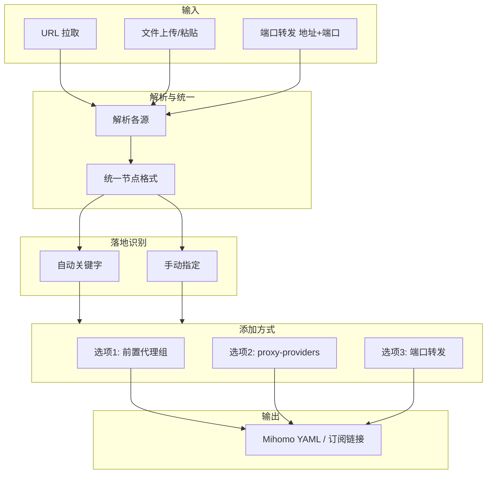

# 03 - 配置流程与添加方式

> 依赖：[02-prerequisites](02-prerequisites.md) 中的中转节点、落地节点及统一节点格式。

---

## 一、配置来源与加载

| 方式 | 说明 | 状态 |
|------|------|------|
| URL 拉取 | 订阅链接或 YAML 配置 URL，后端 `requests.get()` 获取 | 已实现 |
| 文件上传 | 用户上传本地 YAML 文件 | 待实现 |
| 内容粘贴 | 用户粘贴 YAML 文本 | 待实现 |

**说明**：与 [02-prerequisites](02-prerequisites.md) 中的中转节点、落地节点输入形式一一对应。链式代理与端口转发**均需**完整 YAML 作为修改基础；端口转发模式下需额外填入或粘贴 (server, port)（可多个）。

---

## 二、落地节点识别

| 方式 | 说明 |
|------|------|
| 自动识别 | 按节点 `name` 匹配关键字（如 `落地`、`Landing`、`出口`、`exit`），可配置扩展 |
| 手动指定 | 用户从节点列表中勾选/指定未被自动识别的节点 |

**协议识别**：端口转发时，所有协议均只需替换 `server` 与 `port` 字段，参见 [02-prerequisites](02-prerequisites.md)。

---

## 三、为落地节点添加配置的三种方式

### 3.1 选项一：添加前置代理组 (proxy-groups)

**适用**：中转节点来自 YAML/订阅，且节点在 `proxies` 中。链式代理的落地节点**仅支持 ss、SOCKS5**，不允许 reality。

**流程**（ss / SOCKS5 节点直接修改原节点）：

1. 在 `proxy-groups` 中新增：
   - `name`: `"<落地节点名称> dialer"`
   - `type`: 默认 `url-test`，可选 `select`
   - `url`: `https://cp.cloudflare.com/generate_204`
   - `interval`: `300`
   - `tolerance`: `50`
   - `proxies`: 用户从分类结果中选择的节点名称列表

2. **节点分类**：将 `proxies` 中所有节点按 `name` 匹配 7 类区域正则：
   - 香港 (HK)、美国 (US)、日本 (JP)、新加坡 (SG)、台湾 (TW)、韩国 (KR)、其他 (Other)
   - 建议：先匹配前 6 类，未命中则归为 Other（避免超长负向断言）

3. **UI**：7 个区域折叠展示，可整组勾选或展开单选；展示已加入 proxy-group 及新建 dialer 组的节点；**落地节点本身不可作为其前置**，若出现在某组中则对应项置灰不可选。

4. 在落地节点上添加 `dialer-proxy`，节点名改为 `原名称 + 空格 + "链式"/"Chain"`（根据原节点名是否含中文自动选择）

**节点范围**：仅针对 `proxies` 列表；proxy-providers 中的节点不需要解析，仅需在 proxy-groups 中保留 `use` 引用。

---

### 3.2 选项二：添加 proxy-providers

**适用**：中转节点以 `proxy-providers` 形式提供。

**流程**：

1. 从已有 `proxy-providers` 中单选一个 provider（如 `provider1`）
2. 在 `proxy-groups` 中新增：
   - `name`: `"<落地节点名称> dialer"`
   - `type`: `select`
   - `use`: `[providerX]`
3. 在落地节点上添加：`dialer-proxy: "<落地节点名称> dialer"`

**约束**：若配置中无 `proxy-providers`，选项二应隐藏或禁用。

---

### 3.3 选项三：端口转发

**适用**：中转形式为「转发机地址+端口」，或用户希望用转发机替换落地节点的出口地址。允许多个中转机（多个 (server, port) 对）。

**流程**（按落地节点类型区分）：

1. **ss / SOCKS5 节点**：直接修改原节点，替换 `server`/`port`，节点名改为 `原名称 + 空格 + "转发"/"Forward"`
2. **reality 节点**：复制落地节点生成新节点，原节点保留；新节点替换 `server`/`port`，命名为 `原名称 + 空格 + "转发"/"Forward"`

---

## 四、数据流

