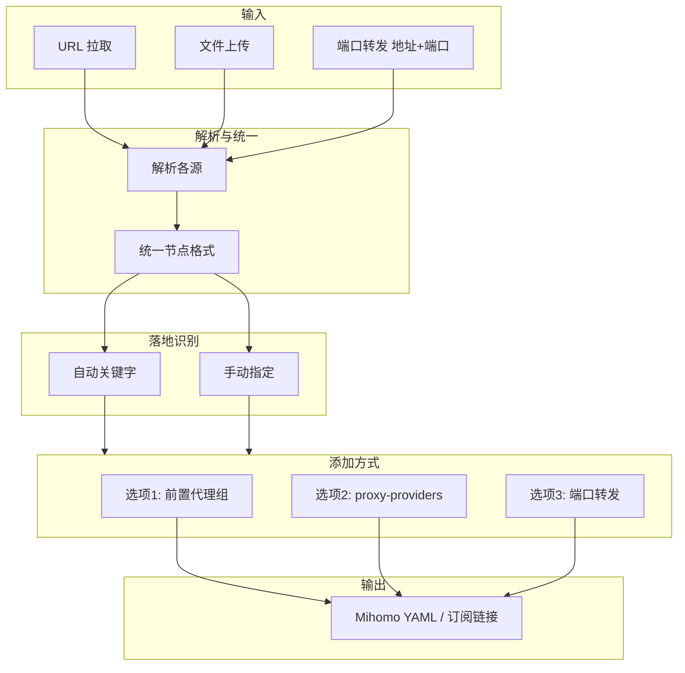

# 03 - 配置流程与添加方式

> 依赖：[02-prerequisites](02-prerequisites.md) 中的配置文件（必填）、落地节点（必填）、端口转发（选填）及统一节点格式。

---

## 一、配置来源与加载

| 方式 | 说明 | 状态 |
|------|------|------|
| URL 拉取 | 订阅链接或 YAML 配置 URL，后端 `requests.get()` 获取 | 已实现 |
| 非 YAML URL 解析 | 订阅链接（base64 编码的 vmess://、ss://、trojan:// 等）解析为 YAML，参考 subconverter 的 `subparser.cpp`（`explodeConfContent`、`explodeSub`）及 `subexport.cpp`（`proxyToClash`） | 待实现 |
| 文件上传 | 用户上传本地 YAML 文件 | 待实现 |

**说明**：本章默认已获得「配置文件」对应的完整 YAML 作为修改基础（依赖结构见 [02-prerequisites](02-prerequisites.md)）。端口转发模式下需额外填入或粘贴 `(server, port)`（可多个）。

---

## 二、落地节点识别

| 方式 | 说明 |
|------|------|
| 自动识别 | 按节点 `name` 匹配关键字（如 `落地`、`Landing`、`出口`、`exit`），可配置扩展 |
| 手动指定 | 用户从节点列表中勾选/指定未被自动识别的节点 |

**协议识别**：端口转发时，所有协议均只需替换 `server` 与 `port` 字段，参见 [02-prerequisites](02-prerequisites.md)。

**落地节点写入/合并到配置**：完成落地节点识别/选择后，需要确保该落地节点存在于最终输出配置的 `proxies:` 中（**若已存在则跳过**），以便后续选项一/二可以对其添加 `dialer-proxy` 或进行复制改名等操作。

- **已存在**：按 `name` 精确匹配（必要时可结合协议与关键字段二次校验）判断落地节点是否已在 `proxies:` 内，存在则直接进入下一步
- **不存在**：将落地节点按「统一节点格式」补齐字段后追加到 `proxies:`（保持原有 `proxies:` 顺序不变，在尾部追加即可）
- **同名冲突**：若追加时发现同名节点，按既定命名规则先重命名后再写入（避免覆盖/歧义）

---

## 三、为落地节点添加配置的三种方式

**前置校验 / 提示**（进入选项前检查）：

- **链式代理（dialer-proxy）**：落地节点必须为 **ss / SOCKS5** 协议（不支持 reality）。若用户选中了 reality 作为落地节点，应提示其改用端口转发方案或更换落地节点协议。
- **端口转发**：
  - **专线中转**：推荐使用 **ss** 协议作为落地节点
  - **直连线路优化的中转机**：推荐使用 **reality** 协议的落地节点

### 3.1 选项一：添加前置代理组 (proxy-groups)

**适用**：中转节点来自 YAML/订阅，且节点在 `proxies` 中。链式代理的落地节点**仅支持 ss、SOCKS5**，不允许 reality。

**流程**（ss / SOCKS5 节点直接修改原节点）：

1. 在 `proxy-groups` 中新增：
   - `name`: `"<落地节点名称> dialer"`
   - `type`: 默认 `url-test`，可选 `select`（选 `select` 时无需 `url`、`interval`、`tolerance`）
   - `url`: `https://cp.cloudflare.com/generate_204`（仅 `url-test` 需要）
   - `interval`: `300`（仅 `url-test` 需要）
   - `tolerance`: `50`（仅 `url-test` 需要）
   - `proxies`: 用户从分类结果中选择的节点名称列表

2. **节点来源**（两种模式）：
   - **默认自动分类**：将 `proxies` 中所有节点按 `name` 匹配 7 类区域正则（香港 HK、美国 US、日本 JP、新加坡 SG、台湾 TW、韩国 KR、其他 Other），先匹配前 6 类，未命中则归为 Other
   - **手动选择**：提供原文件中所有 proxy-groups（策略组）及 `proxies` 节点供用户选择

3. **UI**：默认模式下 7 个区域折叠展示，可整组勾选或展开单选；手动模式下策略组同样折叠展示，可整组勾选或展开单选。下方确认区展示选中作为"<落地节点名称> dialer"策略组成员的分组和节点；**落地节点本身不可作为其前置**，若出现在某组中则对应项置灰不可选。

> **重要（防递归死循环）**：必须检查落地节点 **不出现在** `"<落地节点名称> dialer"` 策略组的成员中（无论是直接选择单个节点，还是“整组勾选”展开后包含了该落地节点）。一旦发现包含，应在 UI 层置灰并在保存前从候选/已选列表中剔除，确保 dialer 组 `proxies` 列表不包含落地节点自身。

4. 在落地节点上添加 `dialer-proxy`，节点名改为 `原名称 + 空格 + "链式"/"Chain"`（根据原节点名是否含中文自动选择）

**节点范围**：仅针对 `proxies` 列表；proxy-providers 中的节点不需要解析，仅需在 proxy-groups 中保留 `use` 引用。

---

### 3.2 选项二：添加 proxy-providers

**适用**：中转节点以 `proxy-providers` 形式提供。

**流程**：

1. 从已有 `proxy-providers` 中单选一个 provider（如 `provider1`）
2. 在 `proxy-groups` 中新增：
   - `name`: `"<落地节点名称> dialer"`
   - `type`: `select`
   - `use`: `[providerX]`
3. 在落地节点上添加：`dialer-proxy: "<落地节点名称> dialer"`

**约束**：若配置中无 `proxy-providers`，选项二应隐藏或禁用。

---

### 3.3 选项三：端口转发

**适用**：中转形式为「转发机地址+端口」，或用户希望用转发机替换落地节点的出口地址。允许多个中转机（多个 (server, port) 对）。

**节点改写策略**（按落地节点类型区分；不仅用于端口转发，也适用于所有会对落地节点做“改名 / 增加 `dialer-proxy` / 替换 `server`/`port`”的操作）：

1. **ss / SOCKS5 节点**：直接修改原节点（按操作需要改名、增加 `dialer-proxy`、或替换 `server`/`port` 等）
2. **reality 节点**：保留原节点不动；复制生成新节点并对新节点做改名、增加 `dialer-proxy`（若适用）、或替换 `server`/`port` 等操作（避免影响原直连能力）

**端口转发的命名**：对被转发后的节点（直接改写或复制的新节点）命名为 `原名称 + 空格 + "转发"/"Forward"`。

---

## 四、数据流

