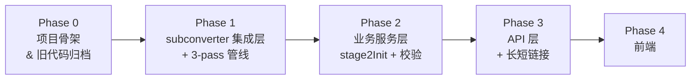

# Chain-Subconverter Vibe Coding 推进计划

## 现状评估

### Spec 成熟度

| Spec | 状态 | 备注 |
|------|------|------|
| `00-governance` | ✅ 稳定 | 治理规则已固化 |
| `01-overview` | ✅ 稳定 | 三阶段流程、术语、全局约束已清晰 |
| `02-frontend-spec` | ⚠️ 可用 | UI 规格完整，后续可能微调 |
| `03-backend-api` | ✅ 稳定 | API 契约、error model、编码规范详细 |
| `04-business-rules` | ✅ 稳定 | 3-pass 管线、校验、改写规则完备 |
| `05-tech-stack` | ✅ 稳定 | Go+Gin+React+TS+Vite 选型已确认 |

**结论**：spec 已具备足够的可实现度，**不必以"spec 完善"为前提阻塞开发**。后续如发现遗漏，可在开发过程中局部修正。

### 已有产出

- **Staged test case**：`3pass-ss2022-test-subscription`（含 `case.json`、3 pass URL/YAML fixtures、测试文档）
- **Legacy code**：`chain-subconverter.py`、`script.js`、`frontend.html`、`Dockerfile`、`requirements.txt` — Python 旧实现，按 governance 仅供参考

---

## 推荐策略：**测试用例先行，驱动局部实现**

> [!IMPORTANT]
> 不建议"继续 review spec"或"纯写测试不实现"。推荐 **边写测试用例边同步开发局部实现**。理由：
> - Spec 已足够成熟，继续打磨是低 ROI 的投入
> - 纯写测试但不做实现，测试无法运行验证，容易偏离实际
> - 测试 + 局部实现同步推进，可以最快暴露 spec 的隐含假设

### 分阶段路线图



#### Phase 0：项目骨架 & 旧代码归档（本次执行）

- 把所有旧实现文件移入 `_legacy/` 归档目录
- 初始化 Go module、创建 `05-tech-stack.md` 定义的目录结构
- 初始化前端工程骨架（`web/`）
- 更新 `.gitignore`、`README.md`、`AGENTS.md`

#### Phase 1：subconverter 集成层 + 3-pass 管线

- 实现 `internal/subconverter/` — 唯一的 subconverter 调用入口
- 以已有 `testdata/subconverter/3pass-ss2022-test-subscription/`（对应 test-subscription 脱敏样例）作为 golden test 基线
- 测试重点：URL 拼接正确性、pass 参数约束、超时/并发控制

#### Phase 2：业务服务层

- 实现 `internal/service/` — stage2Init 构建、区域识别、生成前校验、YAML 改写
- 测试重点：决策表覆盖（2.5 初始化决策表的每个场景）、链式/端口转发改写正确性

#### Phase 3：API 层 + 长短链接

- 实现 `internal/api/` — Gin handlers
- 实现 `internal/store/` — SQLite 短链接索引
- 实现 `internal/config/` — 可配置参数
- 实现 `cmd/server/` — 启动装配
- 测试重点：API 端到端、长链接编码/解码确定性、短链接幂等性

#### Phase 4：前端

- React + TypeScript + Vite + Tailwind CSS 三阶段 UI
- 测试重点：浏览器 E2E

---

## Proposed Changes

### 本次执行范围：Phase 0 — 项目骨架 & 旧代码归档

---

### 归档旧代码

将以下文件/目录移入 `_legacy/`：

| 来源 | 去向 |
|------|------|
| `chain-subconverter.py` | `_legacy/chain-subconverter.py` |
| `script.js` | `_legacy/script.js` |
| `frontend.html` | `_legacy/frontend.html` |
| `Dockerfile` | `_legacy/Dockerfile` |
| `requirements.txt` | `_legacy/requirements.txt` |
| `favicon.ico` | `_legacy/favicon.ico` |
| `RELEASES.md` | `_legacy/RELEASES.md` |
| `templates/` | `_legacy/templates/` |
| `venv/` | 删除（不跟踪） |
| `__pycache__/` | 删除（不跟踪） |
| `logs/` | 删除（已 gitignore） |

> [!NOTE]
> `_legacy/` 加前缀 `_` 以在目录列表中自然排列在最前面，同时明确表达"不再活跃"。

---

### 新建目录结构

按 `05-tech-stack.md` §8 推荐结构创建骨架文件：

```text
chain-subconverter/
├── _legacy/                   # 归档旧实现
├── cmd/
│   └── server/
│       └── main.go            # [NEW] 空启动入口
├── internal/
│   ├── api/                   # HTTP handlers
│   ├── service/               # 业务逻辑
│   ├── store/                 # SQLite 存储
│   ├── subconverter/          # subconverter 集成
│   └── config/                # 配置管理
├── web/                       # 前端工程（后续 Phase 4 初始化 Vite）
├── deploy/
│   └── docker-compose.yml     # [NEW] 占位
├── docs/
│   ├── spec/                  # 权威 spec（不动）
│   ├── testing/               # 测试用例文档（不动）
│   ├── legacy/                # 旧 spec（不动）
│   └── archive/               # 最老文档（不动）
├── testdata/
│   └── subconverter/          # subconverter 测试夹具（不动）
├── AGENTS.md
├── README.md
├── LICENSE
├── go.mod                     # [NEW]
├── go.sum                     # [NEW]
├── .gitignore                 # [MODIFY] 追加 Go/Node 相关规则
└── .gitattributes
```

---

### 更新 `.gitignore`

追加：
- Go: `bin/`, `*.exe`
- Node: `node_modules/`, `web/dist/`
- 移除 Python 专用条目（保留通用条目即可，旧文件已归档）

---

### 更新 `README.md`

更新项目说明，反映重构阶段和新目录结构。

---

## Verification Plan

### Phase 0 验证

Phase 0 是纯文件结构调整，无运行时代码：

1. `git status` 确认文件移动正确
2. `go mod tidy` 验证 Go module 初始化成功
3. 目录结构 `tree -L 3 -I 'venv|node_modules|.git|__pycache__|_legacy'` 确认符合 `05-tech-stack.md` §8

### 后续 Phase 验证（不在本次执行范围）

- Phase 1：`go test ./internal/subconverter/...` + golden test 对比 `testdata/`
- Phase 2：`go test ./internal/service/...` + 决策表场景覆盖
- Phase 3：`go test ./internal/api/...` + httptest 端到端
- Phase 4：浏览器 E2E
